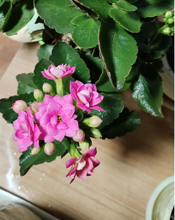

时间：2023-01-14 17:32:32

参考：

1. [也许是最容易种的花：长寿花](https://zhuanlan.zhihu.com/p/33561474)
2. [长寿花](https://zh.wikipedia.org/wiki/%E9%95%BF%E5%AF%BF%E8%8A%B1)

## 植物简介  长寿花

**可能是最好养的花。**

花语：大吉大利，长命百岁，福寿吉庆。

花期：春节前后。

### 长寿花 简介

又称家乐花、矮生伽蓝菜、圣诞伽蓝菜、寿星花、布洛斯费尔德高凉菜，属景天科伽蓝菜属，原产于非洲的马达加斯加。

株高40厘米，叶圆形或椭圆形，深绿色，叶片边缘为钝齿状，长约二至八厘米，肉质叶的边缘略带红色，叶面光亮，终年常绿。对生花簇生，原种花为单瓣红色，但人工培育的花色多，有红、橙、黄、紫等多种颜色，花期较长，花期为冬季至春季，约为十二月下旬至翌年五月，并且开花量大，近年培养出重瓣花品种，在园艺上逐渐取代单瓣花品种。

#### 繁殖

可用扦插及播种繁殖，扦插利用茎插及叶插皆可，但茎插较为方便快捷。茎插时先剪下健康植株的顶芽，长约5至6公分，待伤口愈合后，插入培养土中，保持土壤湿润及空气流通，高于摄氏30度时要洒水降温，约2周后发根，即可开始施肥。 而叶插则选取健康肥大的叶片切下，把切好叶片放到阴凉处约半小时待伤口晾干愈合，然后浅插进或平铺在透气沙土上，保持沙土半潮湿，切勿过湿，否则容易腐烂，空气干燥或寒冷时可加透明膜包好保湿及保温，放在有柔和阳光照射及通风处，一个月内可生根，四个月可出芽。

通常在研发园艺培育品种的初期才会使用种子繁殖。长寿花多数于三月播种，只需将种子洒在湿润的泥土上，将种子在泥面轻轻压实，然后用透明胶袋包着保湿，放在有阳光的地方，但不可强光照射，约十日后便开始发芽，此时可除去胶袋，但需注意不可让泥土过干，若空气干燥时需喷水雾来保湿，待长出八对叶片后，可移到全日照或半日照地方正常管理。

#### 种植

长寿花喜欢阳光充足但日照时间短的生长环境，宜在全日照至半日照环境种植，放置在阴暗处容易徒长，在炎夏正午时要避免阳光直射，以免烧伤叶片，生长速度中等。

长寿花来自半沙漠地区，耐干旱，要泥土干燥才可浇水，冬季时更要减少浇水，只需维持土壤不致干透即可，浇水过多容易造成茎及根烂。在开花后，长寿花会进入休眠，期间要减少浇水，不可以施肥，约六个星期后才开始恢复正常的生长和浇水。

长寿花不能忍受12℃以下的气温，而最适合生长温度是18至27℃，所以在低温时应将长寿花放入室内明亮处越冬及作保暖措施。 长寿花不耐寒，生长适温为15至25℃，高温超过30℃则会生长受阻，冬季室内温度需12至15℃，低于5℃时，叶片就会发红，花期也会推迟，如室温超过24℃会抑制开花，温度在15℃至24℃左右则会开花不断。

长寿花为短日照植物，可在九月中旬开始进行短日照管理，暂停施肥，并每天至少要有十四小时待在黑暗中才可开花。

### 品种

长寿花经多年人工繁殖，品种繁多，按花形分类有重瓣长寿花、单瓣长寿花、宫灯长寿花，按叶片的形状可分为裂叶、羽叶、及原种的玫瑰叶。长寿花花色多，主要有红色、橙色，黄色，紫色，白色、粉红色以及双色混合等。

长寿花常见品种有： 

卡罗琳──叶小，花粉红； 西莫内──大花种，花纯白色，9月开花； 

内撒利──花橙红色； 阿朱诺──花深红色； 米兰达──大叶种，花棕红色；叶片密集翠绿，临近圣诞节日开花，拥簇成团， 花色丰富，是惹人喜爱的室内盆栽花卉。