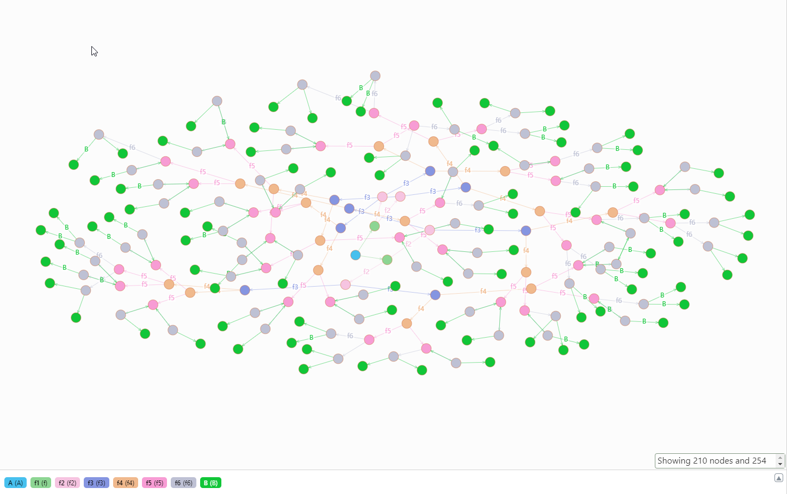

时间: 2020-10-20 17:51:51

## Dgraph 六度空间理论-人与人之间关系的例子

根据 [六度空间理论](https://baike.baidu.com/item/%E5%85%AD%E5%BA%A6%E7%A9%BA%E9%97%B4%E7%90%86%E8%AE%BA/6494090) 两个陌生人之间最多通过六个朋友就能相识。即你认识一个陌生人的最长路径如下：

```
你->朋友->朋友->朋友->朋友->朋友->朋友->陌生人
```

## 数据

###  数据定义

使用程序生成随机数，模拟人与人之间的关系。朋友之间的关系是相互的，即A是B的朋友那么B也是A的朋友。

数据特征：

0. 假设世界只有100万人。
1. 生成100万个人，每个人有一个编号 `uid`、`num` 和 `friend` 。uid唯一，num唯一，都可以用来标识一个人。
2. 每个人从`100万-1`个人中随机 (0~200] 个朋友。由于生成朋友的时候没有考虑已经是朋友的情况，朋友数量可能和预期数量存在偏差。

### Dgraph 数据结构

```
type Person{
  num       # 编号
  friend    # 朋友
}

num: string @index(term, exact) .
friend: [uid] .
```

####  数据导入

使用命令从文件中导入数据，数据需要使用数据生成程序生成。命令如下：

```
dgraph live -f dgraph-data-file.rdf --alpha localhost:9080 --zero localhost:5080 -c 1
```

导入数据耗时：

```
Number of TXs run            : 201900
Number of N-Quads processed  : 201899348
Time spent                   : 6h23m10.634168116s
N-Quads processed per second : 8782
```

### 数据查询

1. 根据六度空间理论查询A可能认识的所有朋友，即查询 `A->朋友->朋友->朋友->朋友->朋友->朋友->B`,B 的数量就是A认识的所有朋友的数量。由于数据比较多，下面查询限制查询数量，查询语句以及效果图如下。


```
{
  f as A(func: eq(num,1)) {
    num
    f1 as f1: friend(first: 2, offset:0) @filter(not(uid(f))){
      num
      f2 as f2: friend (first: 2, offset:0) @filter(not(uid(f1,f))) {
        num
        f3 as f3: friend (first: 2, offset:0) @filter(not(uid(f2,f1,f))) {
          num
          f4 as f4: friend (first: 2, offset:0) @filter(not(uid(f3, f2,f1,f))) {
            num
            f5 as f5: friend (first: 2, offset:0) @filter(not(uid(f4, f3, f2,f1,f))) {
              num
              f6: friend (first: 2, offset:0) @filter(not(uid(f5, f4, f3, f2,f1,f))) {
                num
                B: friend(first: 2, offset:0){
                  num
                }
              }
            }
          }
        } 
      }
    }
  }
}

```



## 数据生成程序

数据生成程序用go语言编写，[源码地址](https://github.com/sunfeilong/dgraph-person)，生成1000000用户，每个用户最大200个朋友，生成程序耗时80秒，生成文件大小5.6GB。由于生成随机数的时候会设置随机数种子，所以参数相同时可以保证生成的数据完全相同。

[数据生成程序-下载地址](https://github.com/sunfeilong/dgraph-person/releases/tag/v1.1.1) 

### 程序命令模板

```
# 查看说明
./dgraph-person -h
./dgraph-person.exe -h  
# 初始化数据
./dgraph-person -command generate -count 100000 -maxFriendCount 200 -filePath "./test.rdf"
./dgraph-person.exe -command generate -count 100000 -maxFriendCount 200 -filePath "d://test.rdf"
# 清空Dgraph数据
./dgraph-person -command clean -host 127.0.0.1 -port 9080
./dgraph-person.exe -command clean -host 127.0.0.1 -port 9080
# 更新Dgraph数据结构
./dgraph-person -command clean -host 127.0.0.1 -port 9080
./dgraph-person.exe -command clean -host 127.0.0.1 -port 9080
```

### 命令说明:

**command** 参数指定需要执行什么操作。

  * **generate:** 初始化数据。需要同时指定 `count` 、 `maxFriendCount` 和  `filePath` 参数。命令会删除 `filePath` 文件然后重新创建。
  * **clean:**  清空dgraph数据库里面的所有数据。需要同时指定 `host` 和 `port` 参数。
  * **update:** 更新Dgraph 的Schema，内容是 `Dgraph 数据结构`的内容。需要同时指定 `host` 和 `port` 参数。
  * **host:** dgraph 地址。
  * **port:** dgraph 端口。
  * **count:** 初始化用户数量。
  * **maxFriendCount：** 每个用户最大朋友数量。
  * **filePath：** 生成数据存放位置，具体的文件，程序执行的时候会先删除对应的文件然后再创建文件。
