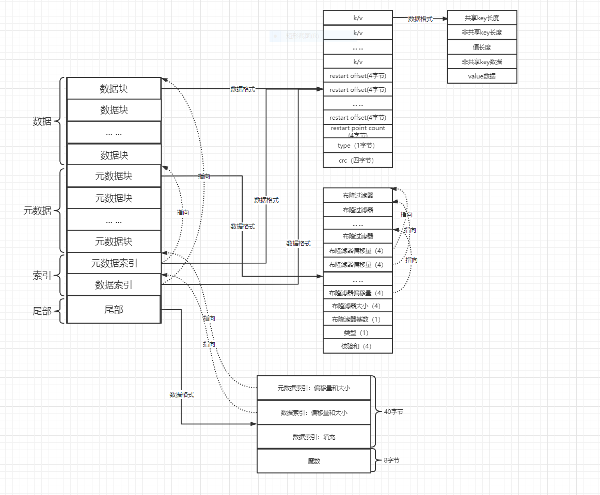

时间: 2022-10-21 17:44:44

参考：

1. [精通LevelDB 廖环宇 张仕华]()

## LevelDB SST 结构

在SST中查找数据的过程：

* 第一步：从尾部读取到`数据索引`区域的位置。
* 第二部：从`数据索引`区域解析出`元数据索引`和`数据索引`信息。
* 第三步：使用`数据索引`定位到`数据块`的位置。
* 第四步：根据`数据块`的位置（每2KB数据一个布隆过滤器）和 `元数据索引`信息定位到`数据块`对应的`布隆过滤器`的位置。
* 第五步：使用`布隆过滤器`判断数据是否存在于块中，如果不存在执行第七步，如果存在执行下一步。
* 第六步：根据 `restart point` 定位对应的 `key` 的位置，如果找到，则返回。如果没找到则执行第七步。
* 第七步：继续从其他层级的SST中继续查找。直到第七层，没找到则key不存在。

**SST文件分四个区域：**

* 数据：存储 key、value数据。
* 元数据：存储 数据区域的博隆过滤器。
* 索引区域：元数据索引，找到元数据的位置，数据索引：key索引。
* 尾部：存储魔数、校验和、索引区域位置等。

### 数据组成：

**数据块区域由四部分组成：**

* k/v：存储k/v数据。
* restart offset：重启点偏移量，重启点后面的数据使用压缩前缀方式存储。
* type：数据压缩类型。
* crc：校验和。

**元数据块**：

* 数据块的布隆过滤器（每2KB数据一个布隆过滤器，由过滤器基数确定）。
* 过滤器偏移量：记录每个过滤器的偏移量。（4字节）
* 过滤器大小：一共有多少个过滤器。
* 过滤器基数：表示多少数据一个布隆过滤器。常数： `(2*1024)B = 2KB`。
*  类型：压缩类型，无压缩。
* 校验和。

**索引区域：**

* 元数据索引：元数据偏移量和大小。（用数据块存储，key是布隆过滤器的名字）
* 数据索引：有序存储数据块的key索引，可以使用二分查找。（用数据块存储，key是大于上一个数据块最大key，小于下一个数据块最小key的一个中间值）。

**尾部数据组成**：

* 元数据索引偏移量和大小。
* 数据索引偏移量和大小。
* 填充。
* 魔数：标识是LevelDB SST文件。