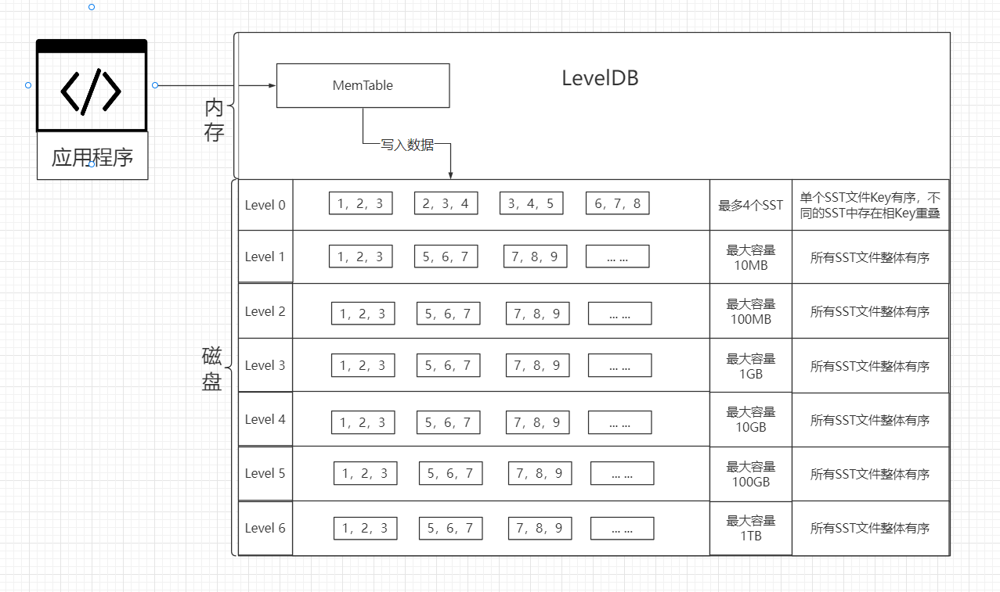

2022--10-21 15:15:12

参考：

1. [精通LevelDB 廖环宇 张仕华]()

## LevelDB 层级数据压缩

### 基础知识

*　SST：Sorted String Table，基于文件系统的存储。
* MemTable： 内存Table，LevelDB 基于跳表实现。
* SST文件大小：2MB
* 无效访问次数：`max(100,file_size / (6*1024))`

    ```
      // We arrange to automatically compact this file after
      // a certain number of seeks.  Let's assume:
      //   (1) One seek costs 10ms
      //   (2) Writing or reading 1MB costs 10ms (100MB/s)
      //   (3) A compaction of 1MB does 25MB of IO:
      //         1MB read from this level
      //         10-12MB read from next level (boundaries may be misaligned)
      //         10-12MB written to next level
      // This implies that 25 seeks cost the same as the compaction
      // of 1MB of data.  I.e., one seek costs approximately the
      // same as the compaction of 40KB of data.  We are a little
      // conservative and allow approximately one seek for every 16KB
      // of data before triggering a compaction.
    ```
* 最大层数：7

### LevelDB 层级 设计




应用程序写入数据，写入的数据会先存到日志文件（磁盘备份）和对应的MemTable中（内存中）。

当MemTable的大小达到指定值时，会把MemTable中的数据以SST格式写入到 `level-0` 中。

**压缩策略：**

* 数量和大小：对于 `level-0` 当SST数量大于4的时候触发压缩。对于 `level1~level5` 当文件大小达到该层的大小限制时触发压缩。
* 无效访问：查找Key时，如果Key位于SST文件最小Key和最大Key之间，如果没有从SST中找到Key对应的值，这次查找被称为无效查找。当无效查找次数大于指定值时，触发压缩。

优先执行 **数量和大小限制** 触发的压缩、然后执行 **无效访问** 触发的压缩。

**压缩过程：**

* 选择出压缩涉及到的文件，压缩文件所在层的文件和下一层文件。
* 使用归并方法合并选中的文件到下一层。

**执行压缩操作：**

```c++
void DBImpl::BackgroundCompaction() {
  // MemTable* mem_;
  // MemTable* imm_ GUARDED_BY(mutex_);  // Memtable being compacted
  // 如果等待压缩的 MemTable 不为空，则压缩 MemTable
  if (imm_ != nullptr) {
    CompactMemTable();
    return;
  }
    
  // 选择压缩涉及到的文件信息
  Compaction* c = versions_->PickCompaction();;

  Status status;
  if (c == nullptr) {
    // Nothing to do
  } else {
    CompactionState* compact = new CompactionState(c);
    status = DoCompactionWork(compact);
    if (!status.ok()) {
      RecordBackgroundError(status);
    }
    CleanupCompaction(compact);
    c->ReleaseInputs();
    RemoveObsoleteFiles();
  }
}
```

**选择需要压缩的文件：**

```c++
Compaction* VersionSet::PickCompaction() {
  Compaction* c;
  int level;
    
  //优先使用执行数量和大小限制触发的压缩，然后执行无效访问触发的压缩
  const bool size_compaction = (current_->compaction_score_ >= 1);
  const bool seek_compaction = (current_->file_to_compact_ != nullptr);
  
  if (size_compaction) {
    level = current_->compaction_level_;
    c = new Compaction(options_, level);

    //选择第一个最小Key大于上次压缩文件最大Key的文件，如果没有则压缩第一个文件
    for (size_t i = 0; i < current_->files_[level].size(); i++) {
      FileMetaData* f = current_->files_[level][i];
      if (compact_pointer_[level].empty() ||
          icmp_.Compare(f->largest.Encode(), compact_pointer_[level]) > 0) {
        c->inputs_[0].push_back(f);
        break;
      }
    }
    if (c->inputs_[0].empty()) {
      // Wrap-around to the beginning of the key space
      c->inputs_[0].push_back(current_->files_[level][0]);
    }
  } else if (seek_compaction) {
    level = current_->file_to_compact_level_;
    c = new Compaction(options_, level);
    c->inputs_[0].push_back(current_->file_to_compact_);
  } else {
    return nullptr;
  }

  c->input_version_ = current_;
  c->input_version_->Ref();

  // 如果文件在 Level-0 层，则需要找出该层所有于最小key和最大key范围有重合的文件
  if (level == 0) {
    InternalKey smallest, largest;
    GetRange(c->inputs_[0], &smallest, &largest);
    // Note that the next call will discard the file we placed in
    // c->inputs_[0] earlier and replace it with an overlapping set
    // which will include the picked file.
    current_->GetOverlappingInputs(0, &smallest, &largest, &c->inputs_[0]);
  }

  //第一步：先从根据key范围从下一层找出需要合并的文件
  //可能存在的优化: 
  //  找出当前层和下一层要归并文件的key范围,从当前层找出与key范围重合的文件。
  //  再次找出所有文件的key范围，在下一层中找出与key范围重合的文件，
  //  如果在下一层找出的文件和第一步一样且文件大小总和没有超出限制，则执行优化，
  //  否则不执行优化，回到第一步的状态。
  SetupOtherInputs(c);

  return c;
}
```

**压缩文件：**

```c++
Status DBImpl::DoCompactionWork(CompactionState* compact) {

    
  // Snapshots are kept in a doubly-linked list in the DB.
  // Each SnapshotImpl corresponds to a particular sequence number.
  if (snapshots_.empty()) {
    compact->smallest_snapshot = versions_->LastSequence();
  } else {
    compact->smallest_snapshot = snapshots_.oldest()->sequence_number();
  }

  Iterator* input = versions_->MakeInputIterator(compact->compaction);
  input->SeekToFirst();
    
  while (input->Valid() && !shutting_down_.load(std::memory_order_acquire)) {
    
    Slice key = input->key();
    // Handle key/value, add to state, etc.
    bool drop = false;
    // 判断一个key是否需要被丢弃
    // ... ...  
    if (!drop) {
      // 打开文件并追加key到文件中  
      // Open output file if necessary
      if (compact->builder == nullptr) {
        status = OpenCompactionOutputFile(compact);
        if (!status.ok()) {
          break;
        }
      }
      if (compact->builder->NumEntries() == 0) {
        compact->current_output()->smallest.DecodeFrom(key);
      }
      compact->current_output()->largest.DecodeFrom(key);
      compact->builder->Add(key, input->value());

      // Close output file if it is big enough
      // 如果文件大于指定大小(2MB), 则把数据写入磁盘
      if (compact->builder->FileSize() >= compact->compaction->MaxOutputFileSize()) {
        status = FinishCompactionOutputFile(compact, input);
        if (!status.ok()) {
          break;
        }
      }
    }
    input->Next();
  }
}
```