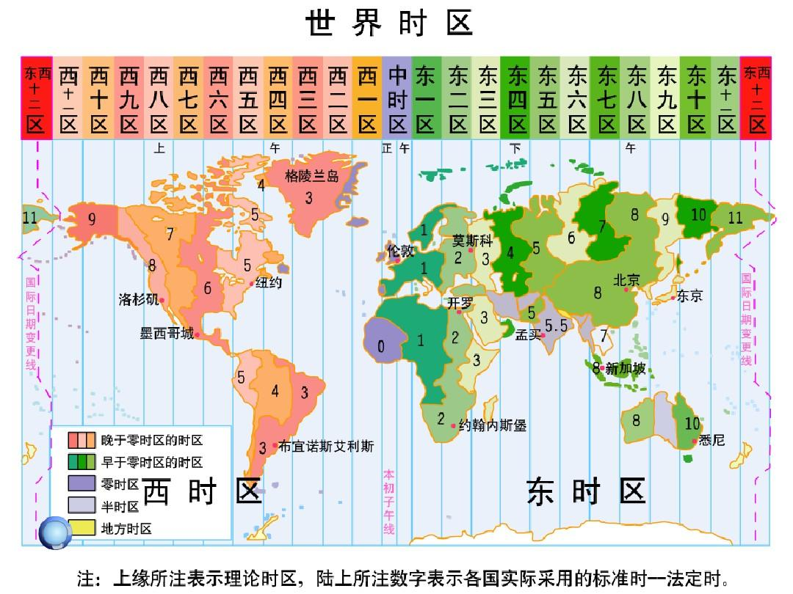

##  
日期：2016-11-21 7:33:37 
参考文章：  

1. [UTC时间](https://time.is/UTC)  
2. [选择合适的 MySQL 日期时间类型来存储你的时间](https://zhuzhichao.com/post/2016/08/which-data-field-should-be-selected)


## 时区简介   
地球自西向东自转（从地球仪上面看是逆时针转）。东边比西边向先到太阳（国际日期变更线以西地区至国际日期变更线之间）。国际日期变更线西边比东边的日期早24小时。  

由于地球自转，每个时区看到太阳的时间都不一样，如果全世界都用统一的时间（比如北京）表示本地时间，就会出现在北京看到日出的时间是早上5点，而纽约看到日出的时间18点（13个小时之后），人们更习惯于把日出的时间定义为早上，时区就解决了这个问题，根据时区能确定一个地点的本地时间（一个时区15度，时间差是一个小时）。  

但是，时间就是时间，比如说北京现在是下午十四点，纽约是凌晨一点，虽然（本地）时间不一样，但是是一个时间点。只有把时间换算到同一个时区，时间点的先后顺序才能进行比较。纽约凌晨一点换算到北京所在东八区就是下午14点。

北京：东八区 (下午13点) 
伦敦：东零区 (早上05点) 
纽约：西五区 (早上00点)   

时区划分图： 

 

## [世界协调时](https://time.is/UTC)  

协调世界时，又称世界统一时间、世界标准时间、国际协调时间。由于英文（CUT）和法文（TUC）的缩写不同，作为妥协，简称UTC。  

协调世界时是以原子时秒长为基础，在时刻上尽量接近于世界时的一种时间计量系统。

标准基准时间：1970年1月1日0时0分0秒0毫秒。

### Java 里面的日期

* System.currentTimeMillis() : 当前时间与标准基准时间之间的时间差，以毫秒为单位测量。 
* new Date(long dete) ：参数表示自从标准基准时间以来经历的毫秒数。 
* Calendar：提供了瞬时时间（时间点）与年月日之间的转换，以及变更时间和时区的一些方法。

* 对应下面的例子：

    ```java
    long time = System.currentTimeMillis();

    Calendar calendar = Calendar.getInstance();
    printDateInfo(calendar);

    Date date = new Date(time);

    calendar.setTime(date);
    printDateInfo(calendar);

    calendar.setTimeZone(TimeZone.getTimeZone(ZoneId.of("UTC")));
    calendar.setTime(date);
    printDateInfo(calendar);
    ```

* 输出如下：时间基本相同，第一个和第二个第三个有一点差别的原因是调用 `System.currentTimeMillis()` 的时间不同所造成的，本地时间则是根据时区转换之后的结果。
	
    ```
    时区: Asia/Shanghai	时间: 1515573278691	本地时间: 2018-1-10 16:34:38 691
    时区: Asia/Shanghai	时间: 1515573278649	本地时间: 2018-1-10 16:34:38 649
    时区: UTC	时间: 1515573278649	本地时间: 2018-1-10 8:34:38 649
    ```

### MySQL 里面的日期  

#### 日期类型:   

|日期时间类型	|占用空间	|日期格式	|最小值	|最大值	|零值表示|
|:--:|:|::|::|::|::|
|DATETIME	 |8bytes| YYYY-MM-DD HH:MM:SS|1000-01-01 00:00:00  |9999-12-31 23:59:59 | 0000-00-00 00:00:00|
|TIMESTAMP   |4bytes| YYYY-MM-DD HH:MM:SS|1970-01-01 08：00：01 |2038年              |  00000000000000   |
| DATE	     |4bytes| YYYY-MM-D          |1000-01-01           | 9999-12-31         | 0000-00-00         |
|TIME	     |3bytes| HH:MM:SS           |-838:59:59           |	838:59:59         | 00:00:00         |
|YEAR        |1bytes| YYYY               |1901                 |  2155              | 0000               |

#### 日期类型简介:  

* DATETIME：表示的日期范围最广，但是不记录时区信息，存进进去的日期是什么，取出来的日期就是什么。比如说在北京存入`2018/1/10 17:28:03`，那么在纽约取出来之后还是 `2018/1/10 17:28:03`,如果时间需要和时区有关联，那么可以在存入日期的时候，把日期转换为同一的时区，进行存储，取出来之后再转换为本地时区。也可以用 `bigint` 存储标准时间的毫秒数，之后结合 `Calendar` 进行时区转换。  

* TIMESTAMP: 记录的时间有范围限制，但是同时也保存时区相关信息。

    * timestamp 更适合来记录时间，比如我在东八区时间现在是 2016-08-02 10:35:52， 你在日本（东九区此时时间为 2016-08-02 11:35:52），我和你在聊天，数据库记录了时间，取出来之后，对于我来说时间是 2016-08-02 10:35:52，对于日本的你来说就是 2016-08-02 11:35:52。所以就不用考虑时区的计算了。  

* Date：用于只需要存储年月日的情况。  

* TIME: 用于只需要表示时分秒的情况。

* YEAR：用于只需要保存年份的情况。

### 其他内容 

* Unix timestamp   

    Unix时间戳(Unix timestamp)，或称Unix时间(Unix time)、POSIX时间(POSIX time)，是一种时间表示方式，定义为从格林威治时间1970年01月01日00时00分00秒起至现在的总秒数。

    4个字节。
	
    可以表示的最远的日期： 2038年01月19日03时14分07秒 二进制 `01111111 11111111 11111111 11111111` 。