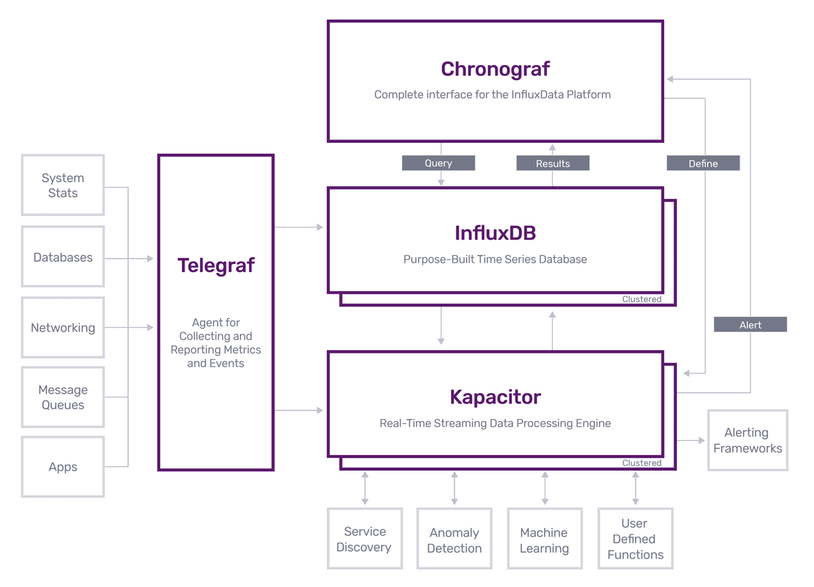

时间：2020-09-22 14:27:27 

## 时序数据

时序数据是随着时间持续产生的数据，如股票价格，天气情况（温度，适度和风力等），计量表（电表、水表等）数值。需要对数据进行一些聚合操作。数据组成如下：

* 时间戳：数据产生时间。
* 标签：键值对。数据源标签，用于区分数据。一个或多个。
* 值：键值对。数据值。存储时间数据值。一个或多个。

以天气数据为例。间隔五秒钟读取一次数据。数据格式如下：

```
time: 时间戳
tag: <country,国家> <province,省份> <city,城市> <localtioncode,位置编码（全球唯一）>
value: <temperature,温度> <pm2_5, pm2.5> <wind:风力> <wind_direction:风向> ... 
```

每五秒有一条记录，每天有 `24*60*60/5 = 17280` 条记录。 当点位比较多且存储时间较长时数据量会很大。

## 时序数据库 

### [InfluxDB](https://github.com/influxdata/influxdb)

[官网地址](https://www.influxdata.com/)

InfluxDB 支持集群但社区版只支持单机部署。生态系统比较完善。不依赖第三方存储。有可视化工具。

 * Telegraf: 从第三方数据存储系统提取数据。
 * InfluxDB: 存储时序数据。
 * Chronograf:  InfluxDB 的数据展示平台。
 * Kacapitor:  数据处理，可以用于异常数据监控等。

生态系统各组件指尖关系如下：



### [griddb](https://github.com/griddb/griddb)

[官网地址](https://griddb.net/en/)

griddb 支持集群但社区版只支持单机部署。生态系统一般，不依赖第三方存储。基于内存，数据优优先存储于内存中。数据可视化需要使用 `Grafana`。

### [druid](https://github.com/apache/druid/)

[官网地址](https://druid.apache.org/)

druid 支持集群，完全开源。数据可以存储在本地文件系统，S3，HDFS等。默认存储在本地文件系统。自带可视化工具。依赖 `Zookeeper`。

支持从 Kafka、HDFS 、本地磁盘等读取数据。

支持SQL查询。

缺点：数据源和数据存储都依赖第三方，引入过多第三方组件，维护成本较高。

架构图如下：


### [TimescaleDB](https://github.com/timescale/timescaledb)

[官网地址](https://db-engines.com/en/system/TimescaleDB)

数据存储依赖 `PostgreSQL` 。

### [Prometheus](https://github.com/prometheus/prometheus)

[官网地址](https://prometheus.io/)

依赖第三方存储。


### 总结

期望找到一个完全开源、原生数据存储、支持集群的时序数据库。