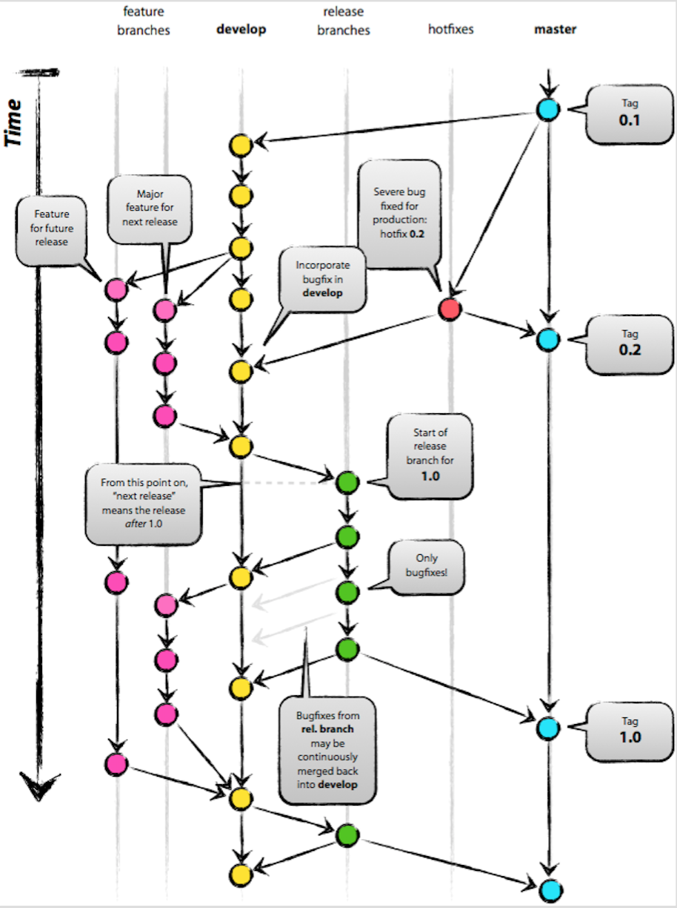

时间：2019/11/25 22:01:43

参考：

1. [GIT版本管理：Git Flow模型](https://juejin.im/post/5a431edb6fb9a04514644fd4) 
2. [Git 代码分支模型（1）：GitFlow、GitHub Flow、Trunk Based Development](http://www.brofive.org/?p=2165)
2. [客户端 GitKraken](https://www.gitkraken.com/)

## GitFLow 分支模型  

### GitFLow 分支模型简介     

GitFlow 是一个分支模型，为 Git 分支管理提供一种可参考的规范，有了规范团队工作才能更高效，同时也能减少出错的可能，当然也需要根据实际情况扩展该模型。

主要分支及作用：

* `develop` 功能开发和bug修复分支。
* `feature` 功能特性分支，功能开发完成后合并回 `develop` 分支。
* `release` 准备发布的分支，从 `develop` 分支创建，用于Bug修复，完成后合到 `master` 分支并，同时合并回 `develop` 分支。
* `master` 版本发布分支。
* `hotfix` 用于修复线上出现的紧急问题。一般的问题可以在 `release` 分支上进行修复。从 `master` 分支创建，问题修复完成之后需要合并回 `master` 分支，同时合并到 `develop`  分支。 

参考下图：

