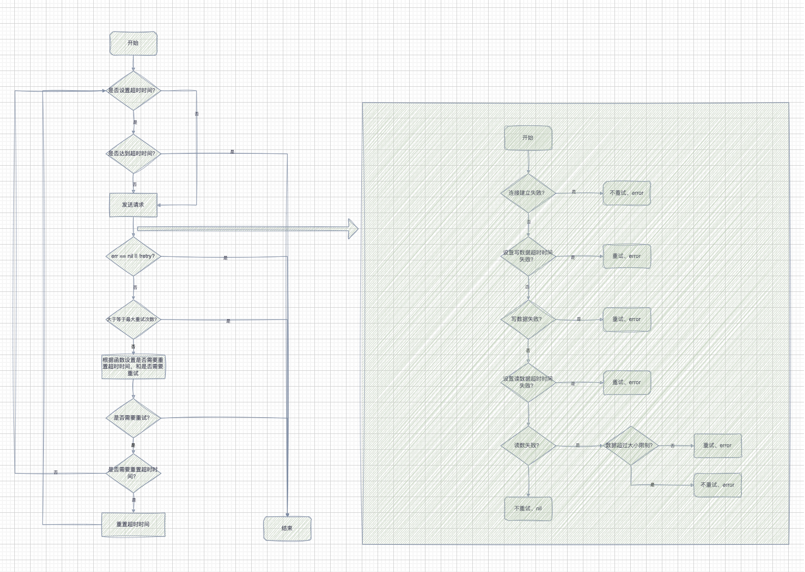

时间：2024-12-20 15:34:50

参考：

1. [https://github.com/valyala/fasthttp](https://github.com/valyala/fasthttp)

## fasthttp 
**版本：**

```go
github.com/valyala/fasthttp v1.57.0
```
### fasthttp client 重试逻辑

先简单记录一下，备用。

fasthttp client 在发送请求的时候如果失败会进行重试，重试场景如下图所示：



初始化Client的时候可以指定重试次数 `MaxIdemponentCallAttempts`，以及请求出现err的时候的重试逻辑 `RetryIfErr`。

```go
clientOnce.Do(func() {
		client = &fasthttp.Client{
			MaxIdemponentCallAttempts:     config.RetryTimes,
			RetryIfErr: func(request *fasthttp.Request, attempts int, err error) (resetTimeout bool, retry bool) {
				//幂等方法
				methodNeedRetry := request.Header.IsGet() || request.Header.IsHead() || request.Header.IsPut()
				if methodNeedRetry {
					return true, true
				}
				return false, false
			},
		}
	})
```