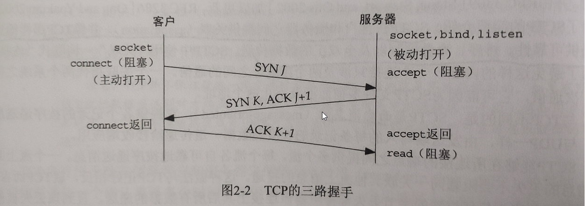
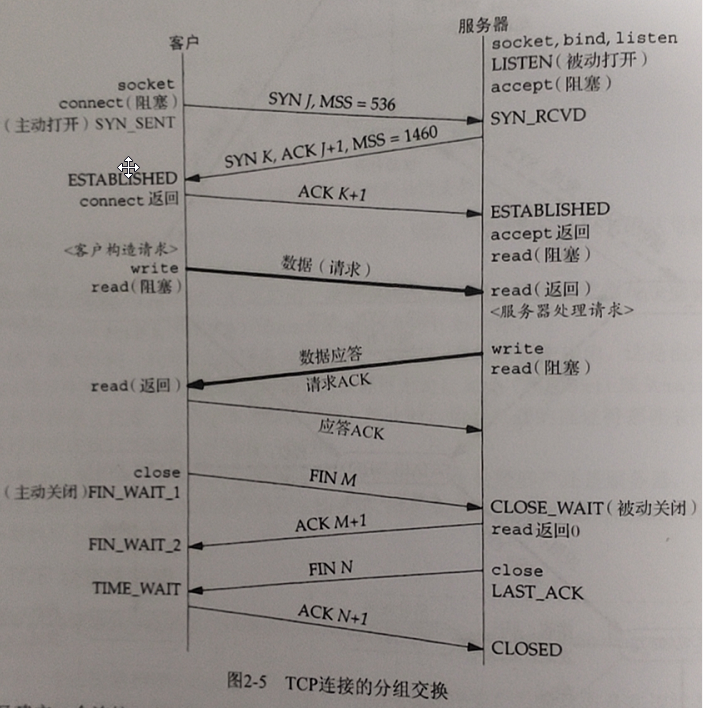

时间：2021-01-09 22:56:56

参考：

1. 《Unix网络编程》- 卷1：套接字联网API（第三版）- W.Richard Stevens、Bill Fenner Andrew M.Rudoff 

1. [TCP为什么需要3次握手与4次挥手](https://blog.csdn.net/xifeijian/article/details/12777187)

## TCP 连接建立和断开

注：客户端用C表示，服务端用S表示。

### TCP 三次握手

**为什么要三次握手？**

为了防止已失效的连接请求报文段突然又传送到了服务端，因而产生错误。防止服务端一直等待，浪费服务端资源。

场景：客户端C发送建立连接请求R1，由于网络延迟R1过了很长时间才到服务端，此时客户端C已经认为连接建立失败。当R1过了很长时间到达服务器之后，如果没有三次握手，服务器接收请求建立连接，此时连接是无效的，会浪费服务端资源。有了三次握手之后，服务端S向客户端C发送确认消息和验证消息，客户端C接收验证消息之后发送确认消息，此时连接建立成功。

如果客户端确认之后服务端消失了，此时客户端建立的连接无效，会耗费客户端的资源。

### TCP 四次挥手

**为什么要四次挥手？**

TCP时全双工的，建立连接时，SYN和ACK消息可以放在一个报文里面一起发送。断开连接时由于被断开连接的一方可能还需要发送消息，可能需要等一段时间后才断开连接，因此不能把FIN和ACK放在一个报文中发送。