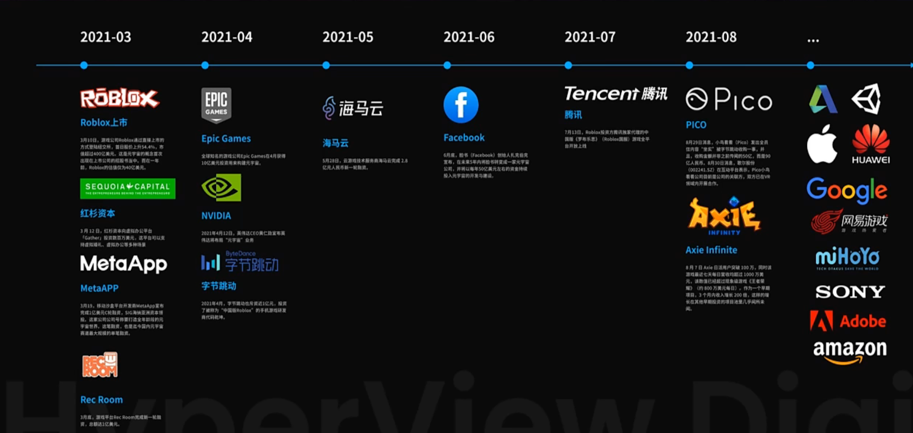

时间：2022-07-25 15:59:59

参考：

1. [肖老师谈元宇宙]([肖老师谈元宇宙_哔哩哔哩_bilibili](https://www.bilibili.com/video/BV1zP4y1J7Cm?spm_id_from=333.999.0.0&vd_source=2c98284f8b9f27cd5fd11b68c25aeabd))

## 元宇宙 游戏

想象一下元宇宙好像确实有很大的可能性。

现在短视频平台这么流行，虚拟显示游戏会令人更加沉迷。

比如一款虚拟现实的游戏，给用户的感官体验可能会更加的真实，更加的令人沉迷，对人有更大的诱惑。

如果有一天元宇宙的入门门槛很低，或者说没有门槛，都是免费的，那么会有多少的人进入这个虚拟的世界。

元宇宙对于刷微博、看短视频、玩游戏、看演唱会、看电影。这类活动的替代性很强，如果有一天在元宇宙中可以这样了，这类活动可能很快就会迁移到元宇宙中。

元宇宙对游山玩水、体验大自然这类活动的替代性会比较低，因为没有真实的感受。

### [roblox](https://roblox.qq.com/)

### [secondlife](https://secondlife.com/)

### 堡垒之夜

### [metahub😅 😂 🤣]

