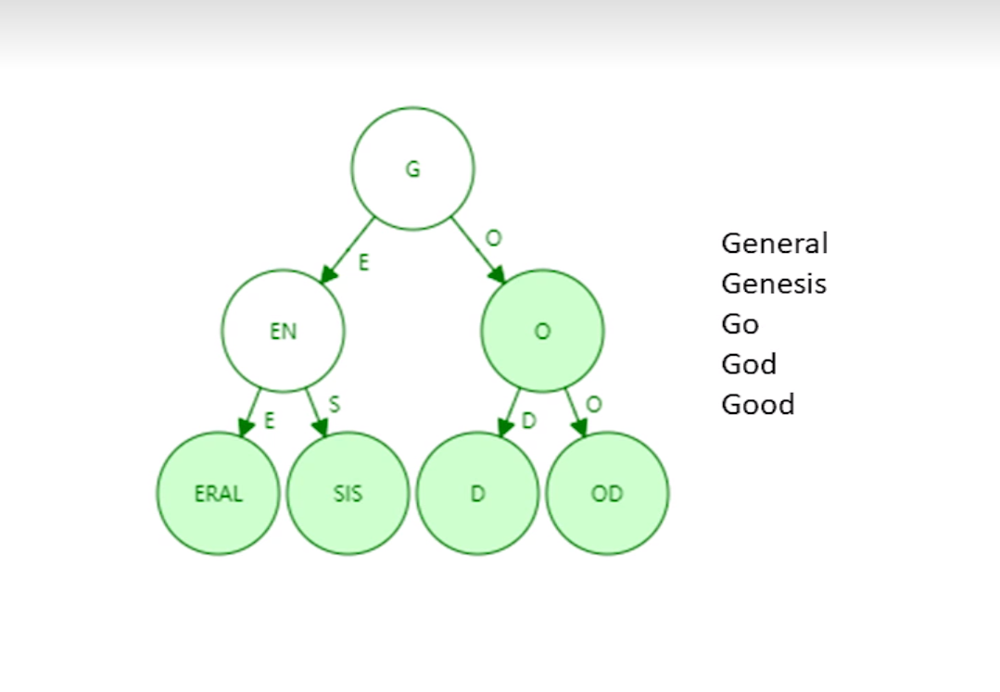
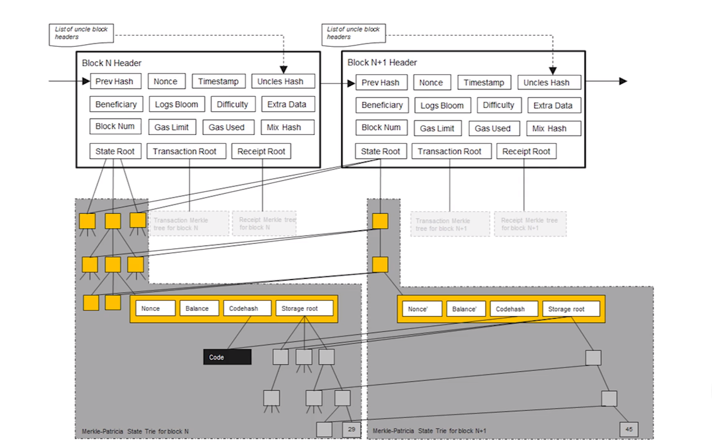
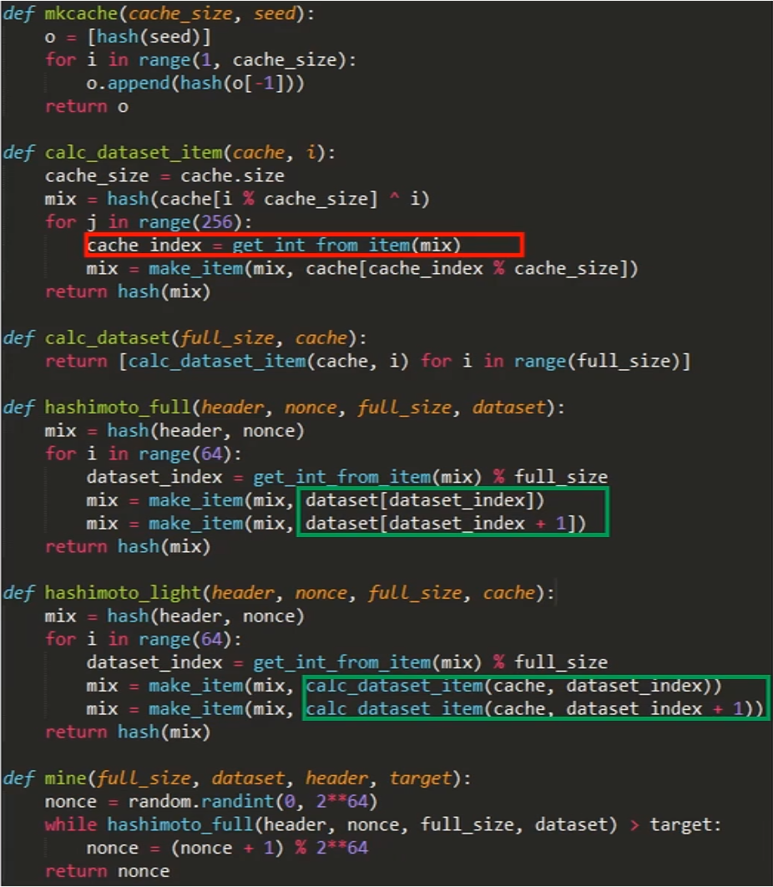

时间：2022-07-16 10:39:39

参考：

1. [go-ethereum](https://github.com/ethereum/go-ethereum)
2. [rinkebyfaucet](https://rinkebyfaucet.com/)
3. [private-network](https://geth.ethereum.org/docs/interface/private-network)
4. [remix](https://remix.ethereum.org/)
5. [web3](https://ethereum.org/zh/web3/)
6. [以太坊白皮书](https://ethereum.org/zh/whitepaper/)
7. [精通以太坊：开发智能合约和去中心化应用](https://weread.qq.com/web/reader/c0532740718247c1c0545f7)
8. [whisper](https://goethereumbook.org/zh/whisper/)
9. [analysis-of-the-dao-exploit](https://hackingdistributed.com/2016/06/18/analysis-of-the-dao-exploit/)

## 区块链 以太坊

愿景：提供一台世界计算机。是以账户为基础的账本（Account Based Leger）。

区块链 2.0，是一个去中心化平台，提供分布式账本，可以运行智能合约（就是代码）。货币名字以太币。

有两种账户都用地址标识，外部账户（Externally Ownerd Account）和 合约账户。合约账户是用户部署合约的一个地址（合约地址根据发送部署合约交易的用户信息可以推算出来）。

账户可以发起交易，交易包含 `From` 和 `To` 这两个重要属性。

如果交易的接收者是外部账户，发起的交易就是一笔转账交易。

如果交易的接收者是合约账户，发起的交易是一次合约调用。

被调用的合约在EVM虚拟机上执行。合约用 `Solidity` 或其他语言编写，然后部署在以太坊上。

交易会被打包进区块，一个区块包含多笔交易。

区块会引用父区块，从而形成链式结构。

区块链的起始块是创世块。

在以太坊中，区块可以有叔块。所有区块内容不重复。

测试合约的时候会把合约部署到测试网络，合约部署之后码就不可以变更，因此需要充分的测试和代码审查，避免漏洞出现。

当合约测试通过之后，可以发布到以太坊主网络。

使用合约提供的函数，可以构造我们的DApp。

### 数据结构

**RLP (recursive length prefix): **编码方式。

**Trie:** 单词查找树。用字符串的公共前缀节省空间。

* 每个节点的分支数目取决于每个元素的取值范围。（以太坊地址16个字母（十六进制）+一个结束符）

* 长度由单词长度决定。（以太坊160位，以太坊地址用16进制表示，所以地址长度是40）

* 不会出现碰撞。

* 相同个数的相同元素，生成的trie结构一样。

* 局部更新。

* 占用存储空间大。

  


**Patricia trie: ** 压缩前缀

* 插入元素，前缀可能需要扩展。



**默克尔帕特丽夏树：Merkle Patricia Tree:**

账户状态树：MPT


下一个区块，只改变变更的账户信息，没有变更的引用之前的。



### 节点类型

* 全节点：存放全部数据，对块和交易进行验证。如  Geth (Go 以太坊客户端)。
* 轻节点：不存链上历史数据，只保存区块当前状态。可以对区块和交易进行验证。
* 远程客户端：不存历史数据，不验证区块和交易，只发起交易。如 `MetaMask`。

## GOST 协议

挖矿本身是无记忆（memoryless），无论是更换随机数，还是已经挖了一段时间之后挖到区块的概率仍然一样。

叔父区块：矿工挖出的区块，但是由于一些原因（比如两个矿工同时挖出一个区块，只有一个会被合入主链）没有被并入主链。叔父区块要满足：区块高度小于当前挖矿区块高度，且不是当前区块父区块，且当前区块高度减去叔父区块高度>=6。

节点挖矿时最多可以添加两个叔父区块（uncle block），叔父区块可以得到（7/8）的出块奖励，引用叔父区块的区块可以获得（1/32）的出块奖励。叔父区块距当前区块越远，叔父区块得到的奖励越小，每多一代减（1/8）直到（2/8）。

叔父区块的交易不会被执行，只检查叔父区块的区块头是否满足挖矿难度。

### 挖矿

`memory hard minig puzzle`

有两个内存空间，缓存空间Cache数组和数据空间DAG数组。

以太坊维护几个常数，Cache数组大小16M，DAG大小1G，随机数种子 seed。每三万个区块，seed会变一次，cache增加原始大小的 1/128（128K），DAG增大1/128(8M)。

**Cache：**先根据seed算出一个哈希作为Cache的第一个元素，然后把第一个元素的哈希作为第二个元素，然后把第二个元素的哈希作为第三个元素，以此类推把数组填满。`make_cache(cache_size,seed)`

**DAG：**根据伪随机的思想，根据`数组大小`和`当前计算的是第几个元素` 计算出一个哈希，然后根据哈希计算出坐标，然后取出cache中的元素计算下一个元素，然后根据下一个元素计算出下一个坐标，从cache中取出，共循环256次，然后计算哈希作为第 `i` 个元素。`calc_dataset_item(cache,i)`。

**挖矿：**用区块头加一个随机数（nonce）计算哈希，根据哈希计算索引从DAG中取出对应索引的元素和后面一个元素（每次取两个），循环64次共取出128个元素。然后把这些数据计算哈希和区块的难度进行比较，如果不满足更换nonce的值重新计算。`hashimoto_full(header,nonce,full_size,dataset)`

**验证：** 用区块头和nonce计算出一个哈希，然后计算出需要计算的DAG的数据索引，根据伪随机算法计算出索引的数据，循环64次，计算出哈希，然后和矿工给出的哈希进行比较。`hashimoto_light(header,nonce,full_size,cache)`。




### 难度调整

```go
// makeDifficultyCalculator creates a difficultyCalculator with the given bomb-delay.
// the difficulty is calculated with Byzantium rules, which differs from Homestead in
// how uncles affect the calculation
func makeDifficultyCalculator(bombDelay *big.Int) func(time uint64, parent *types.Header) *big.Int {
	// Note, the calculations below looks at the parent number, which is 1 below
	// the block number. Thus we remove one from the delay given
	bombDelayFromParent := new(big.Int).Sub(bombDelay, big1)
	return func(time uint64, parent *types.Header) *big.Int {
		// https://github.com/ethereum/EIPs/issues/100.
		// algorithm:
		// diff = (parent_diff +
		//         (parent_diff / 2048 * max((2 if len(parent.uncles) else 1) - ((timestamp - parent.timestamp) // 9), -99))
		//        ) + 2^(periodCount - 2)
		... ...
		... ...
		... ...
}
```

### 网络类型

#### 主网络

以太坊主网络，实际运行的以太坊网络。目前交易的 `ETH` 都在主网络上。

#### 测试网络

以太坊测试网络，模拟运行的以太坊网络，可以在上面部署合约测试以太坊的功能。里面的数据没有实际价值。

测试网络都有对应的 Faucet（水龙头），可以从里面提取对应的测试网络货币，用于发送交易。

可以在 `MetaMask` 里面找到水龙头的地址。

####　私有网络

本地启动以太网客户端，不连接到主网络。可以在控制台和链交互。

注：启动之前需要初始化区块配置，不然会直接连接到著网络。具体配置可参考以太坊官网。

```shell
# 启动节点
./geth --datadir data --networkid 12345 --http --http.addr "192.168.0.201" --http.vhosts "*" --allow-insecure-unlock

# 交互控制台
./geth --datadir data attach
```

### 账户 

账户里面包含如下数据：

* nonce：当前账户地址已发送成功的的交易数量，用于确保每笔交易只能处理一次的计数器。
* balance：账户当前的以太币余额。
* 账户的合约代码（若有），设置之后就不会改变。
* 账户的存储（默认为空）。

账户分为外部账户（Externally Owned Account）和内部账户（合约账户）。

外部账户可以发起交易。

合约账户也可以有以太币，同时可以执行合约代码，完成一些业务。合约可以调用其他合约。

在以太坊中合约用一个地址标识。比如 `0xF45717552f12Ef7cb65e95476F217Ea008167Ae3` 这个地址对应一个合约，在合约代码内部可以直接使用这个地址初始化一个级合约然后调用合约的方法，比如 `Government(0xF45717552f12Ef7cb65e95476F217Ea008167Ae3).round()`，也可以通过 `call` 或者 `delegatecall` 调用合约。

合约地址:[Government](https://etherscan.io/address/0xf45717552f12ef7cb65e95476f217ea008167ae3#readContract)

### 交易

交易以单线程方式执行。

交易内容如下：

* 消息接收者。
* 用于识别发送者身份的数字签名。
* 从发送者转账到接收者的以太币金额。
* 一个可选数据字段。
* STARTGAS 值，表示允许交易运行的最大计算步骤数。
* GASPRICE 值，表示发送者每个计算步骤支付的费用。

### 虚拟机（Enthereum Virtual Machine）

在内存中运行，不使用寄存器，基于栈的虚拟机。

* 执行智能合约。
* 验证交易。

### 智能合约

合约运行在EVM中，每个全节点都有机会运行所有的合约。

合约的数据可以保存在内存中，也可以持久化存储到磁盘中。

`Solidity` 是比较流行的以太坊合约语言，可以通过 Remix 在线编写。

注：由于虚拟机执行和合约调用的原因，以及合约代码是所有人可见的，写合约要注重安全，可能会因为一些不安全的业务逻辑，被黑客攻击。

注：在写合约的时候不要用使用如时间(now)、区块哈希、合约发起者(xt.original)等可被控制或有歧义的数据作为判断条件。

**存取数据合约代码如下：**

```solidity
// SPDX-License-Identifier: GPL-3.0
pragma solidity >=0.7.0 <0.9.0;
contract Storage {
    uint256 number;
    function store(uint256 num) public {
        number = num;
    }
    function retrieve() public view returns (uint256){
        return number;
    }
}
```

合约编译之后会产生两部分内容，分别是 `合约字节码` 和 `ABI (Application Binary Interface)` 合约接口文档。

### DAPP（Decsntarlized Application）

基于以太坊开发的应用程序。

后端：智能合约（应用程序需要可信且去中心化的部分）。

前端：HTML、CSS、JavaScript。可以用(web3.js)和以太坊交互。

数据存储：云端数据库（中心化）、IPFS、或者Swarm（以太坊）。

消息通信协议：Whisper（以太坊去中心化消息通信协议）。

以太坊名称服务：把名字映射到指定的地址。

Swarm：是以太坊提供的内容可寻址的P2P文件存储服务。

Whisper: 是以太坊提供的点对点消息传递协议，可以通过订阅渠道对应的消息。


### ICO (Initial Coin Offering)

是指在区块链平台发行代币众筹资金。类似于IPO。

流程：

1. 创建两个合约，一个代币合约，一个ICO合约。
2. 代币合约用于管理代币，初始化时创建者拥有所有的代币。ICO合约用户众筹资金，提供使用以太币换取代币的函数，代币拥有者会把一部分代币授权给ICO合约。
3. 用户向ICO合约发送以太币换取代币。ICO合约调用代币合约把取得授权的代币中的对应数量的代币发送给用户。
4. 至此代币拥有者获取到了以太币（资金），用户获取到了对应的权益（代币）。

### 预言机

预言机合约，预言机合约里面存储链外数据，可供其他合约调用。

预言机需要保持可信。

### 攻击

**双花攻击（double spending attack）：** 花钱的人不诚实，想再花一次，比特币通过UTXO解决。
**重放攻击（replay attack）：**收钱人不诚实，想再转一次。通过交易中的`nonce`避免。

### 合约攻击

**TheDao：** 利用交易时没有先设置状态，而是先转账然后设置状态，利用转账时的特性，调用调用者的 `fallback` 函数，调用者的 `fallback` 函数再次发起交易。

漏洞代码：

```javascript
function splitDAO(
  uint _proposalID,
  address _newCurator
) noEther onlyTokenholders returns (bool _success) {

  ...
  // XXXXX Move ether and assign new Tokens.  Notice how this is done first!
  uint fundsToBeMoved =
      (balances[msg.sender] * p.splitData[0].splitBalance) /
      p.splitData[0].totalSupply;
  if (p.splitData[0].newDAO.createTokenProxy.value(fundsToBeMoved)(msg.sender) == false) // XXXXX This is the line the attacker wants to run more than once
      throw;

  ...
  // Burn DAO Tokens
  Transfer(msg.sender, 0, balances[msg.sender]);
  withdrawRewardFor(msg.sender); // be nice, and get his rewards
  // XXXXX Notice the preceding line is critically before the next few
  totalSupply -= balances[msg.sender]; // XXXXX AND THIS IS DONE LAST
  balances[msg.sender] = 0; // XXXXX AND THIS IS DONE LAST TOO
  paidOut[msg.sender] = 0;
  return true;
}
```

**美链（Beauty  Chain）：**

交易ID [0xad89ff16fd1ebe3a0a7cf4ed282302c06626c1af33221ebe0d3a470aba4a660f](https://etherscan.io/tx/0xad89ff16fd1ebe3a0a7cf4ed282302c06626c1af33221ebe0d3a470aba4a660f)

攻击者利用数据一处漏洞。

参数：

```shell
Function: batchTransfer(address[] _receivers, uint256 _value)

MethodID: 0x83f12fec
[0]:  0000000000000000000000000000000000000000000000000000000000000040
[1]:  8000000000000000000000000000000000000000000000000000000000000000
[2]:  0000000000000000000000000000000000000000000000000000000000000002
[3]:  000000000000000000000000b4d30cac5124b46c2df0cf3e3e1be05f42119033
[4]:  0000000000000000000000000e823ffe018727585eaf5bc769fa80472f76c3d7  
```

合约代码：
```javascript
function batchTransfer(address[] _receivers, uint256 _value) public whenNotPaused returns (bool) {
    uint cnt = _receivers.length;
    //溢出
    uint256 amount = uint256(cnt) * _value;
    require(cnt > 0 && cnt <= 20);
    require(_value > 0 && balances[msg.sender] >= amount);

    balances[msg.sender] = balances[msg.sender].sub(amount);
    for (uint i = 0; i < cnt; i++) {
        balances[_receivers[i]] = balances[_receivers[i]].add(_value);
        Transfer(msg.sender, _receivers[i], _value);
    }
    return true;
}
```