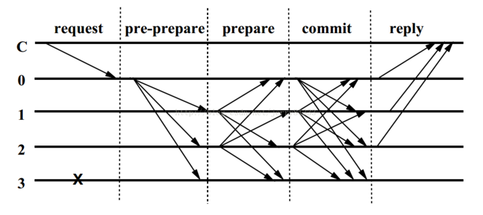

时间：2022-07-26 22:02:02

参考：

1. [共识原理](https://www.cnblogs.com/wanglao/p/11162605.html)
1. [拜占庭容错](https://academy.binance.com/zh/articles/byzantine-fault-tolerance-explained)
2. [什么是区块链共识算法](https://academy.binance.com/zh/articles/what-is-a-blockchain-consensus-algorithm)
3. [25种区块链共识算法全面详解😂](https://cloud.tencent.com/developer/article/1669859)
5. [共识算法](https://docs.chainmaker.org.cn/tech/%E5%85%B1%E8%AF%86%E7%AE%97%E6%B3%95.html)

## 区块链 共识算法

在分布式系统中（P2P），节点之间用来对某些信息达成共识的算法。

**拜占庭将军问题：** 在某些节点可能出现故障或不诚实行为的情况下，分布式计算机节点网络如何就决策达成一致？

### Pow (Proof of work)

工作量证明。算力高的机器更容易获得区块（虽然掷色子的结果是随机的，但是算力高的机器掷的次数多）。

在比特币中，所有节点用区块信息和一个可变更的随机数计算哈希，当计算出的哈希小于等于数值之后，计算出哈希的节点获得记账权。获得出块奖励和交易费。

计算哈希是无记忆的（就像掷色子一样每次出现的点数概率都一样），因此当一个节点把结果广播搭到 `P2P` 网络之后，收到消息的节点计算下一个区块会获得最大利益，保证区块会尽量计算最新区块。

使用者：Bitcoin、Ethereum等。

### Pos (Proof of stake)

权益证明，类似于股份制公司，根据拥有的股份进行投票。

以太坊一直准备切换到权益证明，但是权益证明的机制一直在设计完善，所以一直在推迟。

投票时先质押股票，如果投票结果被选中则获得区块奖励并锁定权益一段时间，没有选中则退还质押股票。如果作弊则没收质押股票。

一种实现：
```
类似于财产储存在银行，这种模式会根据你持有数字货币的量和时间，分配给你相应的利息。

    简单来说，就是一个根据你持有货币的量和时间，给你发利息的一个制度，在股权证明POS模式下，有一个名词叫币龄，每个币每天产生1币龄，比如你持有100个币，总共持有了30天，那么，此时你的币龄就为3000，这个时候，如果你发现了一个POS区块，你的币龄就会被清空为0。你每被清空365币龄，你将会从区块中获得0.05个币的利息(假定利息可理解为年利率5%)，那么在这个案例中，利息 = 3000 * 5% / 365 = 0.41个币，这下就很有意思了，持币有利息。以太坊就是采用POS共识算法。

    从某种角度来看，PoS有点像银行存款，你持有的时间越长，本金越大，你得到的利息会越多。
```

### CFT(Crash Fault Tolerance)

碰撞容错，认为机器可能宕机，网络可能异常，但是所有信息真实可信。

需要至少 `2f+1` 台机器。

代表算法：Paxos、Raft等。

#### Paxos

分布式中没有恶意节点的情况，在两阶段提交中，通过保持最大的提案号来确保提案通过，每次只要超过半数即可。

#### Raft

集群节点有三种状态。Leader、Follower、Candidate。

Leader 节点负责处理请求，并把请求分发到 Follower 节点，在Leader选举的过程中节点处于Candidate状态。

没有恶意节点，只要保持大多数节点可用即可正常运行，部署节点数量 `2N+1`，可以保证最多N个节点宕机，系统仍能正常运行。

假设有一共有 `N` 个节点，`F` 个节点宕机，此时系统要正常运行需要有 `F+1` 个节点正常运行，此时处于临界状态，则 `F+(F+1)=N`，即 `F=（N-1）/2`。即 `N` 个节点的集群，最多宕机 `(N-1)/2` 个节点，集群仍能正常运行。

[图解Raft共识](http://www.kailing.pub/raft/index.html)
[Raft 论文翻译版](https://github.com/maemual/raft-zh_cn/blob/master/raft-zh_cn.md)

使用者：IPFS Private Cluster、Quorum、Etcd、长安链。

### BFT(Byzantine Fault Tolerance) 

拜占庭容错，认为出错的机器是可能说谎的，即信息不可信，需要 `3f+1`。

代表算法：TBFT、PBFT 等。

#### TBFT

主节点轮换没有固定主节点。

TBFT 是一种拜占庭容错的共识算法，可以在拜占庭节点数小于总数1/3的情况下，保证系统的安全运行。

#### PBFT 

有一个固定主节点，当主节点宕机后会根据协议切换主节点。

实用拜占庭容错。三阶段提交。



C为发送请求端，0,1,2,3 为服务端，3为宕机的服务端，具体步骤如下：

1. Request：请求端C发送请求到任意一节点，这里是0。
2. Pre-Prepare：服务端0收到C的请求后进行广播，扩散至1，2，3。
3. Prepare：1，2，3,收到后记录并再次广播，1->0，2，3，2->0，1，3。3因为宕机无法广播。
4. Commit：0，1，2，3 节点在 Prepare 阶段，若收到超过一定数量的相同请求，则进入Commit 阶段，广播 Commit 请求；
5. Reply：0，1，2，3 节点在 Commit 阶段，若收到超过一定数量的相同请求，则对C进行反馈；

使用者：Hyperledger Fabric、Stellar、Ripple、Dispatch。

## 其它算法

### DPos（Delegated Proof  of stake）

委任权益证明。从所有节点中投票选举出一部分节点，选出的节点负责出块。

在 DPoS 系统中，权益持有者可以选举领导者（或称为见证人，Witness）。经权益持有者授权，这些领导者可进行投票。该机制使得 DPoS 要快于正常的 PoS。

例如，EOS 中选举出 21 位见证人，并且有一堆节点（潜在的见证人）作为候选者。一旦见证人节点死亡或是做出了恶意行为，新节点就会立刻替代见证人节点。见证人会因为生成区块而获得一笔支付费用。该费用是由权益持有者设立的 。

通常，所有节点采用轮询方式，一次生成一个区块。该机制防止一个节点发布连续的块，进而执行  `双重支付` 攻击。如果一个见证人在分配给他的时间槽中未生成区块，那么该时间槽就被跳过，并由下一位见证人生成下一个区块。如果见证人持续丢失他的区块，或是发布了错误的交易，那么权益持有者将投票决定其退出，用更好的见证人替换他。

在 DPoS 中，矿工可以合作生成块，而不是像在 PoW 和 PoS 中那样竞争生成。通过区块生成的部分中心化，DPoS 的运行可以比其它共识算法呈数量级快。

从某种角度来看，DPOS有点像是议会制度或人民代表大会制度。如果代表不能履行他们的职责（当轮到他们时，没能生成区块），他们会被除名，网络会选出新的超级节点来取代他们。EOS就是采用DPOS共识算法。

使用者：BitShares、Steemit、EOS、Lisk、Ark。

### Poc(Proof of capacity) 

容量证明。类似于Pow，利用空间代替计算。

使用者：Butcoin、Chia、SpaceMint。

### DPoW（Delayed Proof of work）

延迟工作量证明。

DPoW 是一种混合共识方法，允许一个区块链利用第二个区块链的哈希算力（Hashing Power）所提供的安全。该机制是通过一组公证员节点（Notary Node）实现的。公证员节点实现将第一个区块链的数据添加到第二个区块链中。进而，第二个区块链请求在两个区块链间达成妥协，弱化第一个区块链的安全。Komodo是首个使用该共识方法的区块链，它就是附加于 Bitcoin 区块链之上的。

### POA(Proof od Authority)

权威证明。

基于 PoA 的网络、事务和区块，是由一些经认可的账户认证的，这些被认可的账户称为“验证者”（Validator）。验证者运行的软件，支持验证者将交易（transaction）置于区块中。该过程是自动的，无需验证者持续监控计算机，但需要维护计算机（权威节点）不妥协（uncompised）。

验证者必须满足以下三个条件：

 1. 其身份必须在链上得到正式验证，信息可在公有可用域中交叉验证。
 2. 其资格必须难以获得，这样所得到的验证块的权利才弥足珍贵（例如，潜在的验证者需要获得公证书）。
 3. 建立权威的检查和程序必须完全统一。

使用 PoA，每个个体都具有变成验证者的权利，因此存在一旦获取就保持验证者位置的动机。通过对身份附加一个声誉，可以鼓励验证者去维护交易的过程。因为验证者并不希望让自己获得负面声誉，这会使其失去来之不易的验证者地位。

使用者：POA.Network、Ethereum Kovan testnet、VeChain。

### PoWeight (Proof of weight)

权重证明。

权重证明（PoWeight）是一类很宽泛的共识算法，它基于Algorand共识模型。其基本理念是在 PoS 中，用户所拥有的网络中令牌的百分比，表示了该用户“发现”下一个区块的概率。PoWeight 系统中还使用了其它一些相对加权值，实现包括声望证明（PoR，Proof of Reputation）和空间证明（Proof of Space）。

使用者：Algorand。

### PoR(Proof of Reputation)

声誉证明。

使用者：GoChain。

PoR 类似于 PoA。GoChain 文档中给出了如下描述：

PoR 共识模型依赖参与者在保持网络安全中的声誉。参与者（区块签名者）必须具有足够重要的声誉。一旦他们尝试欺骗系统，那么他们将要面对严重的财政上的和自己名声上的后果。这是一个相对的概念，如果他们被抓到试图欺骗，那么几乎所有的业务将会受到严重的影响。规模越大的企业，通常将会失去更多。这样，相比使用更少的企业（即更小规模的商业），规模更大的企业更易于被选定。

一旦一个企业证明了自己的声誉，并通过了验证，那么他们必须经投票参与到权威节点网络中。这时，PoR 的操作与 PoA 网络一样，即只有权威节点可以签名并验证区块。

### PoET（Proof of Elapsed Time）

所用时间证明。

使用者：HyperLedger Sawtooth。

### PoHistory （Proof of History）

历史证明。

其基本理念是不相信交易中的时间戳，而是证明交易在某个事件之前或之后的某个时刻发生。

如果我们对某期《纽约时报》的封面拍了张照片，那么我们就创建了一个证明，即我们的拍照时间是在该报纸发行之后，或许也可能是我们有某种途径影响了纽约时报的正常发行。我们可以使用 PoHistory 创建一个历史记录，证明一个事件是发生在特定时间之后的。

使用者：Solana。

### PoSV （Proof of Stake Velocity）

权益流通证明。

PoSV 是作为 PoW 和 PoS 的一种替代方法而提出的，其目的是提高 P2P 网络的安全性，进而用于确认 Reddcoin 交易。Reddcoin 是一种加密货币，专为加速数字化时代的社交交互而提出的。PoSV 在设计上鼓励所有者（权益）和活动（流通），直接对应于 Reddcoin 作为真实货币的两个主要功能，即存储价值和交换中介。Reddcoin 也可在异构社交场景中作为计量单位使用。

使用者：Reddcoin。

### PoImportance (Proof of Importance)

重要性证明。

### （PoBurn）Proof of Burn

烧毁证明。

PoBurn 并非在昂贵的计算设备上一掷千金，而通过发送代币到一个不可检索地址实现“烧钱”（Burn）。将代币发送到一个并不存在的地址，用户将根据某个随机选择过程，获得整个生命时间内对系统挖矿的特权。

### PoI （Proof of Identity）

PoI 是一块表示了加密事实的数据。它支持用户指定一个私钥，并对应到一个经认证的身份，加密将附着到一个指定的交易。来自于某些组中的每个个体都可以创建 PoF（因为它只是一块数据），并将该数据展示给其它任何处理节点的人。

### PoActivity （Proof Of Activity）

活动证明。

在 PoActivity 中，挖矿一开始使用的是传统的 PoW，矿工们争相解决加密难题。根据实现，挖掘的区块不包含任何交易，它们更像模板。因此，胜出的区块将只包含头部信息，以及矿工的奖励地址。

此时，系统将切换到 PoS。PoActivity 根据头部信息选择一组随机验证者对新区块签名。如果一位验证者所拥有的系统中代币越多，那么该验证者被选中的可能性也会越大。一旦所有验证者已签名，那么模板就会变成一个完整的区块。

如果在完成区块时，某些选定的验证者是不可用的，那么就选择下一个胜出区块，并选择一组新的验证者，依此类推，直到区块收到到正确数量的签名。费用由矿工和在区块上签名的验证者分摊。

### PoTime （Proof of Time）

时间证明。

### PoExistence （Proof of Existence）

存在证明。

