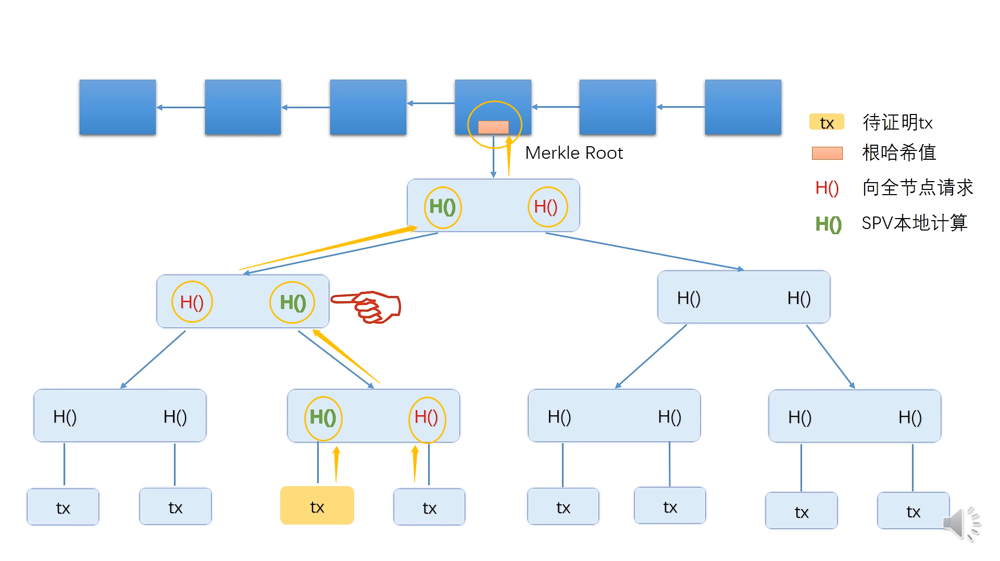
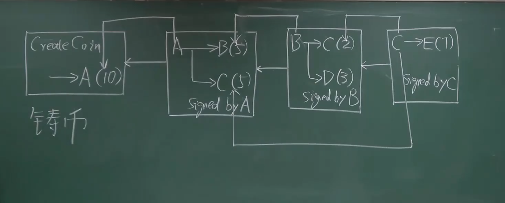

时间：2022-07-22 09:41:41

参考：

1. [《区跨链技术与应用》肖臻](https://www.bilibili.com/video/BV1Vt411X7JF)
2. [比特币白皮书](https://bitcoin.org/files/bitcoin-paper/bitcoin_zh_cn.pdf)

## 区块链　比特币

区跨链1.0

比特币是以交易为基础的账本（Transaction Based Leger）。

以太坊是以账户为基础的账本（Account Based Leger）。

### 数据结构：

#### 区块链（Block Chain）

类似链表结构，使用区块哈希值作为引用。第一个区块叫做创世块（genesis block），第二个区块保存第一个区块内容的哈希，第三个区块保存第二个区块的哈希，。。。，第N个区块保存第N-1个区块的哈希。底层数据结构用 LevelDB(基于文件系统的<Key，Valye>数据库）存储。通过哈希引用验证前面区块是否合法。

#### 默克尔树 （Merkle Tree）

类似于二叉树，最底层存储数据，用左右儿子节点哈希值作为引用，类似于区跨链的结构。通过哈希可以验证数据是否被更改。

在比特币中，默克尔树用于保存区块中的交易列表，区块中保存默克尔树的根哈希（用于引用交易的默克尔树）。

在比特币中存在全节点和轻节点，全节点保存区块头（区块哈希和其他基本信息）和区块体（交易列表），

当轻节点要验证一笔交易在区块中时，会向全节点发送请求，全节点把相关默克尔树节点（图中红色和绿色）的哈希发送给轻节点，轻节点按路径计算出根哈希，然后和区块头中的哈希进行比较，即可验证交易是否在区块中。

当轻节点要验证一笔交易不存在区块中时，需要对默克尔树底层的交易按哈希排序，全节点把哈希值大于和小于给定节点的交易信息发送给轻节点，轻节点进行验证。



### 协议和实现

**区块链：**

区块内容包括：

* 区块头（blockchain header）：版本，区块高度，上一个区块哈希，当前区块默克尔树哈希，nonce。
* 区块体（blockchain body）：交易默克尔树，默克尔树中会包含一笔比较特殊的交易，向矿工账号转币的铸币交易。



如上图所示，执行交易前，会验证交易的账户是否拥有对应的比特币。

比如说：

* A向B和C转账，追踪到铸币的输出为账户A，A拥有对应比特币，因此转账交易合法。
* B向C和D转账之后，B的账户已经没有钱，此时B在发起向其他账户转账的交易，这些交易就是非法的。

**UTXO：**存储用户的比特币

未花费的交易输出列表（Unspent Transaction Output），全节点在内存中维护，用于快速检测用户是否有对应比特币的所有权。

**挖矿：** 在已知区块头信息的情况下，选择一个 nonce [0~2^32]，组合区块头信息和nonce，让这些信息计算出的哈希小于某个值。

通过挖矿解决了分布式共识难题。

矿工挖矿的奖励包含出块奖励和交易费。比特币的挖矿奖励大概四年减半一次。

**攻击：**

* 女巫攻击（sybil attack）：创建超过半数的作恶账号，用于创建恶意的共识结果。比特币用算力挖矿解决这个问题。
* 分叉攻击（forking attack）：通过向区块链中间区块添加区块，达到回滚区块的目的。算例解决。
* selfish miming：挖出节点之后不发布消息，继续挖下一个节点，当挖出多个节点之后一起发布。在大多数节点都是诚实节点的情况下，会跟不上主链的速度然后挖出的区块被丢弃。
* boycott：抵制某个用户A的交易，当攻击者掌握半数以上算力时，如果出区块中出现包含A用户的交易时就分叉。会导致A的交易永远不会被确认。
* **双花攻击（double spending attack）：** 花钱的人不诚实，想再花一次。UTXO结构避免这个问题。

### 网络

基于TCP的P2P网络。节点收到消息之后用 `flooding` 模式向相邻节点发送交易数据，然后标记该消息自己经受收，再次接受不会在处理。节点会把收到的交易放到交易池，打包区块之后从交易池中已经打包的交易。

### 脚本

脚本格式：

**P2PK(Pay To Public Key):**

```shell
# input script
OP_PUSH_DATA(Sig)

# output script
OP_PUSH_DATA(PubKey)
OP_CHECKSIG
```

**P2PKH（Pay To Public Key Hash）：**

```shell
# input script
OP_PUSH_DATA(Sig)
OP_PUSH_DATA(PubKey)

# output script
OP_DUP
OP_HASH160
OP_PUSH_DATA(PubKeyHash)
OP_EQUALVERIFY
OP_CHECKSIG
```

**P2SH(Pay To Script Hash)**

```shell
# input script
***[无意义的数据，解决BUG]
OP_PUSH_DATA(Sig_1)
OP_PUSH_DATA(Sig_2)
...
OP_PUSH_DATA(Sig_M)
OP_PUSH_DATA(serialized redeem script)

# output script
OP_HASH160
OP_PUSH_DATA(RedeemScriptHash)
OP_EQUAL
# run script

# 脚本内容
M
OP_PUSH_DATA(PubKey_1)
OP_PUSH_DATA(PubKey_2)
...
OP_PUSH_DATA(PubKey_N)
N
OP_CHECKMULTISIG
```

比特币的交易通过脚本执行，脚本运行在基于栈的虚拟机上。

对于A把比特币转给B，B把比特币转给C这两笔交易：

A向B转币的交易的输出是一段验证B签名的脚本，用来验证B的签名，此时币的所有权已经到B的名下。输出内容如下：

```shell
OP_DUP
OP_HASH160
OP_PUSH_DATA(PubKeyHash)
OP_EQUALVERIFY
OP_CHECKSIG
```

B向C转币的交易的输入是一段签名的脚本，给自己发起的交易信息签名。

```shell
OP_PUSH_DATA(Sig)
OP_PUSH_DATA(PubKey)
```

B向C转币的验证过程如下：

B->C的输入脚本后面跟着A->B的输出脚本一起执行，执行结果为 True 则标识验证通过，交易可以执行。

### 分叉

**描述**：对于一次协议升级，我们称升级协议的节点为新节点，没有升级协议的节点为旧节点。

**前提条件**：假设大于百分之五十的节点同意升级，即新节点占大多数。

**硬分叉（hard fork）**：如果新节点认可旧节点的区块，旧节点不认可新节点的区块。分叉开始后，旧节点会维护自己认为的最长合法链这条合法链上没有新节点的区块，区块会验证通过（所有节点都同意）。新节点也会维护一条最长合法链这条链上不会有旧节点的区块，因为旧节点的区块在分叉之后不属于新节点的链（所以区块内容是非法的），新节点维护的链上的区块也会验证通过（有一半节点认可）。因此会导致存在两条并行的链被称为**硬分叉**。

**软分叉(soft fork)**：如果新节点不认可旧节点的区块，旧节点认可新节点的区块。当出现分叉时，新节点所在的链为最长合法链，旧节点产生的区块上链时不会被验证通过（大于一半投反对票），因此会导旧就节点的挖矿工作白费，旧节点虽然挖出块但不会上链。这种情况被称为**软分叉**。

注：互相认可不会出现分叉。

注：互不认可只有新节点所在的链是合法链（大于一半节点），和软分叉类似。

总结：多数方不认可少数方会产生软分叉，多数方认可少数方会产生硬分叉。


