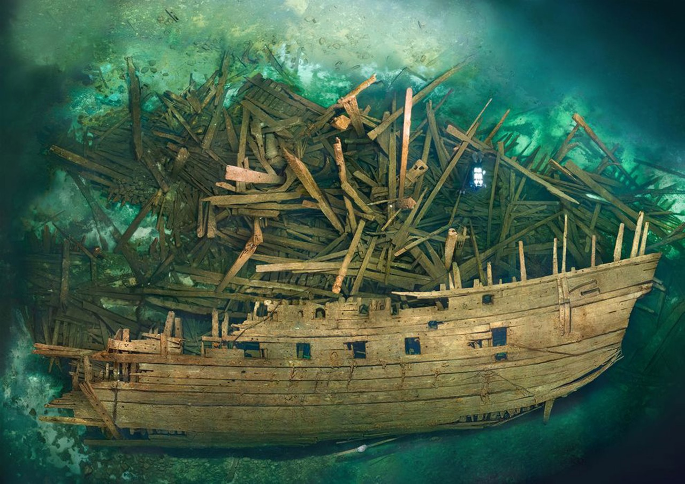

时间: 2020-08-03 20:18:18

参考：

1. [让百度云MD5发生碰撞的图片！](https://tieba.baidu.com/p/4630734543)
2. [制造相同md5的文件](https://github.com/brimstone/fastcoll)

## 字节数据 数据签名 相同MD5的两个文件

MD5 哈希如下：

```shell
[root@centos_201 img]# md5sum airplane.jpg 
253dd04e87492e4fc3471de5e776bc3d  airplane.jpg
[root@centos_201 img]# md5sum ship.jpg 
253dd04e87492e4fc3471de5e776bc3d  ship.jpg
```

图片不同的地方：

```shell
[root@centos_201 img]# hexdump airplane.jpg airplane.txt
[root@centos_201 img]# hexdump ship.jpg ship.txt

[root@centos_201 img]# diff airplane.txt ship.txt
11c11
< 00000a0 1100 0308 05d9 0300 2201 0200 0111 1103
---
> 00000a0 1100 0308 0589 0300 2201 0200 0111 1103
39,20908c39,20908

... ...
... ...

20927c20927
< 0051be0 3d8d cc55 ce51 8a02 9a7c f4b6 45b3 72f6
---
> 0051be0 3d8d cc55 ce51 8a02 9a7c f4b6 3db3 72f6
20931c20931
< 0051c20 9b15 9e11 dbaf e517 8d06 c9db 5e59 f7ae
---
> 0051c20 9b15 9e11 dbaf e517 8d06 c9db 5e55 f7ae
20935c20935
< 0051c60 40bb b78a 7f98 5d37 90ed 79cd 5f4c 796d
---
> 0051c60 40bb b78a 7f98 5d37 90ed 79cd 5f4c 7971
20939c20939
< 0051ca0 6268 b301 e2cf b280 5403 b9eb 7f77 2bbb
---
> 0051ca0 6268 b301 e2cf b280 5403 b9eb 7f77 2abb
20943c20943
< 0051ce0 ca4b 1841 7fd4 2c18 6fa6 d2fc 64fd 2376
---
> 0051ce0 ca4b 1841 7fd4 2c18 6fa6 d2fc 24fd 2376
```


图片如下：


