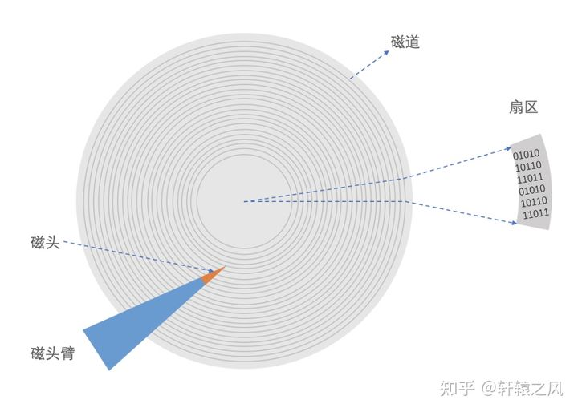
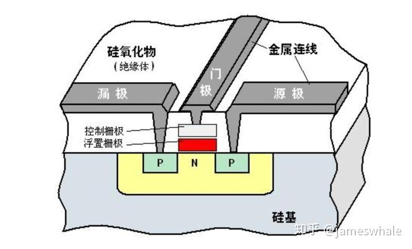

时间: 2022-08-23 16:20:20

参考： 

1. [详解固态硬盘的有趣知识及其底层原理](https://zhuanlan.zhihu.com/p/114237145)
2. [一个故事看懂机械硬盘原理](https://zhuanlan.zhihu.com/p/394971581)

## 操作系统 硬盘

### 机械硬盘

机械硬盘：Hard Disk Drive 简称 HDD。

类似于一个圆盘，通过磁头读取数据。每次读取数据需要经过 `寻道+旋转+读取` 这三个步骤：

* 首先磁头臂带动磁头移动到指定的磁道。
* 接着旋转到指定的扇区。
* 最后连续读取扇区的数据。

根据机械磁盘的特性，如果数据按顺序写在磁盘上，省去寻道和转动到指定扇区的时间，可以大大最大化磁盘读取效率。

### 固态硬盘

固态硬盘：Solid State Drive 简称 SSD。

特性：

* 随着使用时间的增加和可用容量的降低，固态硬盘读写延迟会增大。
* 相当长时间不用，固态硬盘里面的数据可能会丢失。
* 将固态硬盘放置于高温下会影响里面的数据保存期限。
* 垃圾回收不止存在于Java、Golang这些语言里面，固态硬盘很重要的一个特性就是垃圾回收。
* 固态硬盘的擦除和写入次数是有限的，超过则不能保证有效的读写。
* 固态硬盘包含外部接口、CPU、内存、闪存颗粒等，用来接受外部IO请求并根据一定的算法将IO请求落到闪存颗粒。
* 为了延长固态硬盘的使用寿命，固态硬盘控制器需要考虑存储数据的冷热特性，同时也需要引入地址空间虚拟化技术。

**存储概念与原理：**

闪存使用三端器件作为存储单元，分别为 源极、漏极和栅极，主要利用电场的效应来控制源极与漏极之间的通断; 在栅极与硅衬底之间增加了一个浮置栅极，浮置栅极可以存储电荷，利用电荷存储来存储记忆。

擦除（Erase）：释放浮置栅极的电荷，从而使之变成‘1’，这个动作被称为“擦除”。

编程（Program）：向浮置栅极注入电荷，从而使之变成‘0’，这个动作被称为“编程”。

闪存中每个块的 P/E 次数有限；当某个块的 P/E 次数达到上限后，就无法保证能够继续有效地存取数据。

 

**提高SSD的可靠性的方法：**

* 地址空间虚拟化：用于把逻辑址射到磁盘物理地址，这个映射是可变的。
* 容量冗余：实际容量大于标识容量，多余的容量用来替换坏块，或分担 P/E 操作。
* 磨损均衡：尽量使用 P/E 次数少的块。
* 坏块管理：不使用已经坏掉的块。
* 数据冗余保护：使用CRC等校验和，保证数据正确。

**SSD垃圾回收：**

当反复修改一个文件的数据时，SSD为了避免对一个块的修改次数过多，每次修改时会把数据映射到不同的位置，这样就会造成有些块的数据是没用的。也难辞会有垃圾回收。垃圾回收会导致写放大。

* 全随机小 IO 业务场景下，写放大系数约为 2.5。
* 顺序大 IO 业务场景 下，写放大系数约为 1.1 。

