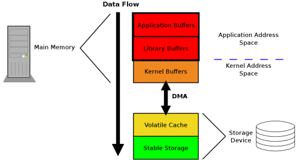

时间： 2022-01-29 10:50:50

参考：

1. [确保数据存放到磁盘](https://lwn.net/Articles/457667/)

## 操作系统-文件系统-数据持久化

### 文件数据从进程到磁盘的过程



1. 调用 `write()` 之后，文件数据进入进程缓存。

2. 调用 `fflush()` 之后，文件数据进入操作系统内核。

3. 调用 `fsync()` 之后，文件数据持久化到磁盘。

注意：使用程序顺序创建文件，虽然文件变更时间可以精确到纳秒级别，但是还是会出现文件变更时间相同的情况。

注意：`fsync` 不保证文件系统检索时不需要的文件元数据属性写入磁盘，比如 `访问时间` `创建时间` `变更时间`。

> The data and associated metadata for write calls to such file descriptors end up immediately on stable storage. Note the careful wording, there. Metadata that is not required for retrieving the data of the file may not be written immediately. That metadata may include the file's access time, creation time, and/or modification time.

### 替换文件原子操作

使用 `rename` 操作的原子性。

1. 创建临时文件把新数据写入到临时文件。
2. 把临时文件重命名为要替换的文件。
3. 更新文件所在目录状态数据。

    ```c
    
    dir_fd = open(dir_path, O_RDONLY);
    
    message_len = strlen(message2);
    
    temp_fd = open(temp_file);
    
    full_write(temp_fd, newdata, data_len);
    
    /* ok, now sync the new file out to disk. */
    fsync(temp_fd) 
    /* close file */
    close(temp_fd) 
    
    /* now rename the new file to replace the old one */
    rename(temp_file, old_file)
    free(temp_fd);

    /* and sync out the directory fd */
    fsync(dir_fd)
    
    close(dir_fd)
    
    ```
