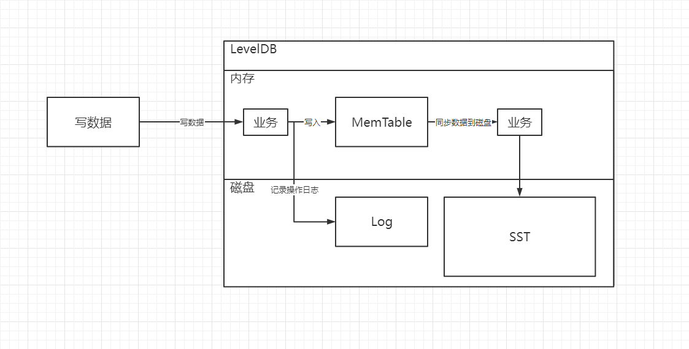

时间：2022-08-11 17:33:33

参考：

1. [鸿篇巨制 —— LevelDB 的整体架构](https://www.cnblogs.com/ludongguoa/p/15354701.html)

## 数据结构 LSM树

全称：Log Structured Merge Tree，结构化日志合并树。

本质上并不是一颗树，而是一种类似的层级合并文件结构，在LevelDB中，即层级文件。

包含及部分：

* Log：记录操作日志。
* MemTable：内存中的数据表（字典），LevelDB基于调表实现。
* Sorted String Table：有序的字符串存储文件。

每一个MemTable对应一个日志文件，当MemTable数据达到限制时，会生成新的MemTable，同时把MemTable的数据写入SST文件中。

在LevelDB中数据写入SST文件后，如果SST文件数量达到层级限制或者文件大小达到限制之后，会触发文件合并操作，把低层级的文件合并到高层级中。

