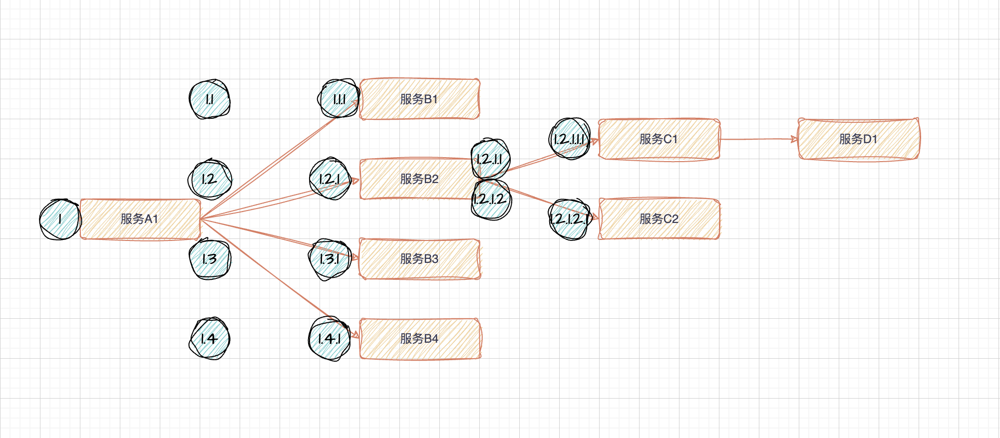

时间： 2024-11-20 15:13:13

参考：

1. [opentelemetry 是什么](https://www.elastic.co/cn/what-is/opentelemetry)

## 服务调用

服务调用



如何记录服务间的调用关系：

**场景一：**服务在调用第三方服务，如接口、数据库、Redis、Kafka等服务的时候，记一条日志，记录调用的服务名字，开始时间、结束时间、是否成功等。

**场景二：**服务在被调用时，如HTTP接口，RPC接口等，记录一条日志，记录当前服务的名字，开始时间、结束时间、是否成功等。在被调用服务内部，调用其它服务的时候同第一步。

对于像Redis、Kafka、MySQL等这些服务，无法在服务内部打印日志记录耗时，只能在调用这些服务的时候记录耗时，即 **场景一**。

以 **服务B2** 为例：


|动作|记录|描述|
|::|::|::|
|服务A1调用服务B2|1.2|记录服务A1调用服务B2的耗时|
|服务B2处理请求|1.2.1|记录服务B2处理请求的耗时|
|服务B2调用服务C1|1.2.1.1|记录服务B2调用服务C1的耗时|
|服务B2调用服务C2|1.2.1.2|记录服务B2调用服务C2的耗时|

记录 1.2 和 1.2.1 是有区别的，1.2 是调用方记录的耗时，1.2.1 是被调用方记录的耗时。1.2.1 记录的耗时一定小于 1.2 记录的耗时，中间的差值可以理解为是服务调用的网络耗时。

### 记录内容

**耗时简图如下：**

```
1.2       ||||||||
1.2.1     |||||||
1.2.1.1   ||||
1.2.1.2   ||||||
```

**记录1.2**

```json
{
    "level": "INFO",
    "time": "2024-12-25 11:01:56.116",
    "caller": "logger/span.go:13",
    "message": "http request",
    "projectName": "go",
    "type": "span",
    "parentSpan": "1",
    "span": "1.2",
    "name": "http request: 127.0.0.1/invoke",
    "spanStartUs": 1735095716071800,
    "spanEndUs": 1735095716113901,
    "spanDurationUs": 42101,
    "timestampUs": 1735095716113893,
    "traceId": "0193fbc3-88e7-7c40-b0d2-53953a0f6af8.go-web-template",
    "durationUs": 42039
}
```

**记录1.2.1**

```json
{
    "level": "INFO",
    "time": "2024-12-25 11:01:56.113",
    "caller": "logger/span.go:13",
    "message": "endpoint response time",
    "projectName": "go-web-template",
    "type": "span",
    "parentSpan": "1.2",
    "span": "1.2.1",
    "name": "/invoke",
    "spanStartUs": 1735095716071808,
    "spanEndUs": 1735095716113868,
    "spanDurationUs": 42060,
    "timestampUs": 1735095716113871,
    "traceId": "0193fbc3-88e7-7c40-b0d2-53953a0f6af8.go-web-template",
    "durationUs": 42039,
    "remoteIp": "127.0.0.1",
    "url": "/invoke",
    "host": "127.0.0.1:8080",
    "path": "/invoke",
    "query": "",
    "postForm": "",
    "requestBody": ""
}
```

**记录1.2.1.1**

```json
{
    "level": "INFO",
    "time": "2024-12-25 11:01:56.083",
    "caller": "logger/span.go:13",
    "message": "success",
    "projectName": "go-web-template",
    "type": "span",
    "parentSpan": "1.2.1",
    "span": "1.2.1.1",
    "name": "serviceA",
    "spanStartUs": 1735095716072142,
    "spanEndUs": 1735095716083034,
    "spanDurationUs": 10892,
    "timestampUs": 1735095716083076,
    "traceId": "0193fbc3-88e7-7c40-b0d2-53953a0f6af8.go-web-template",
    "durationUs": 11253
}
```

**记录1.2.1.2**

```json
{
    "level": "ERROR",
    "time": "2024-12-25 11:01:56.104",
    "caller": "logger/span.go:18",
    "message": "failed",
    "projectName": "go-web-template",
    "type": "span",
    "parentSpan": "1.2.1",
    "span": "1.2.1.2",
    "name": "serviceB",
    "spanStartUs": 1735095716083174,
    "spanEndUs": 1735095716104517,
    "spanDurationUs": 21343,
    "timestampUs": 1735095716104526,
    "traceId": "0193fbc3-88e7-7c40-b0d2-53953a0f6af8.go-web-template",
    "durationUs": 32697
}
```