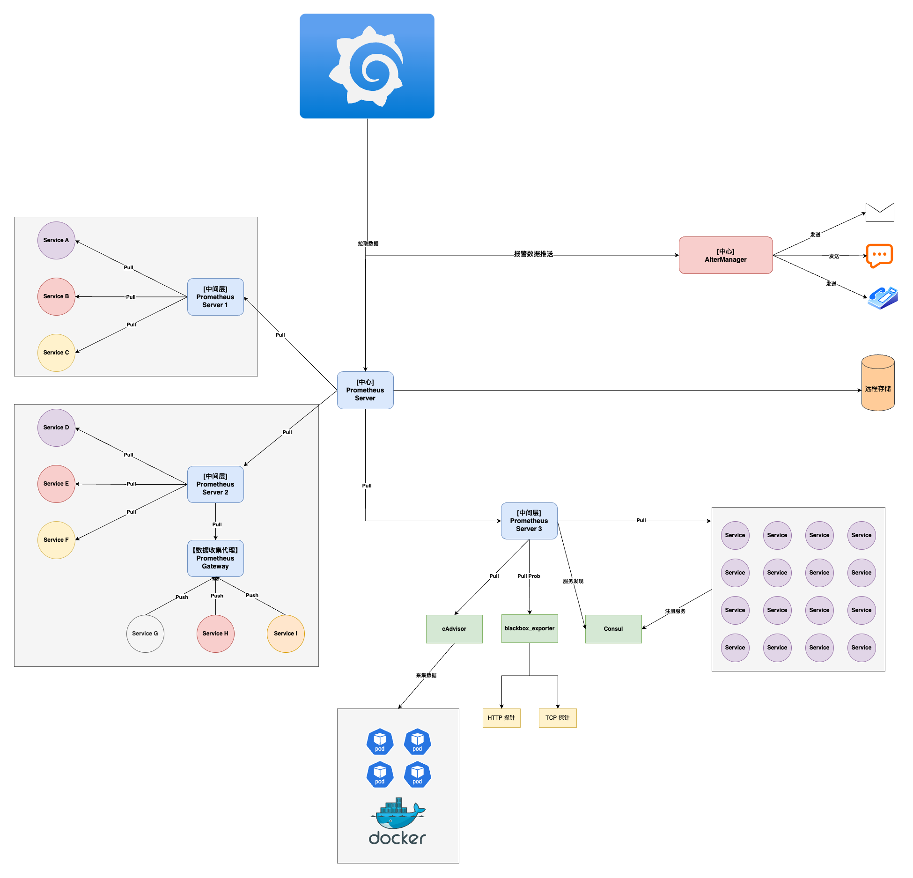
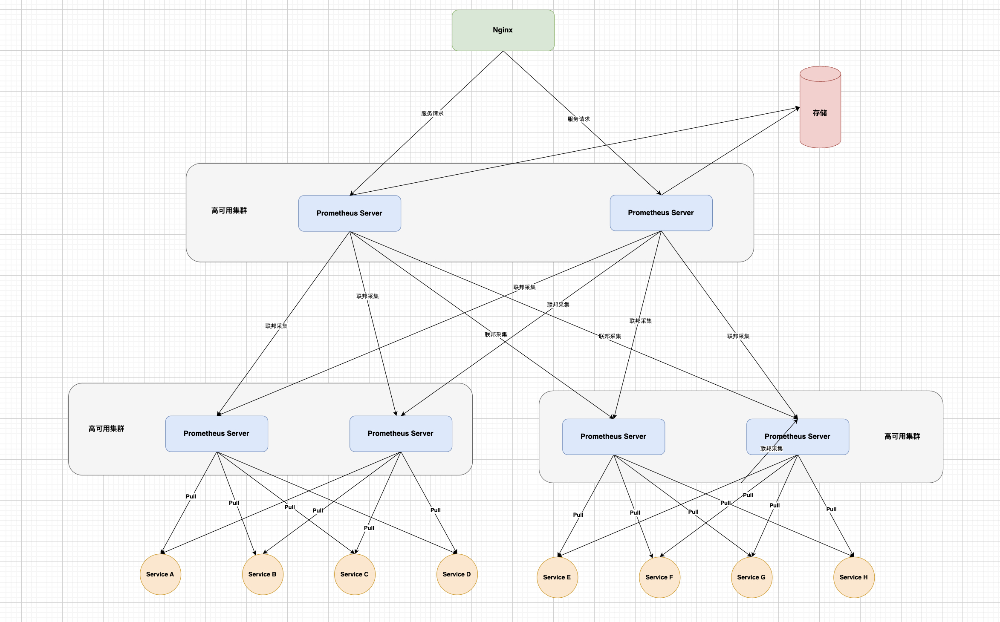

时间：2025-01-08 18:10:10

参考:

1. [prometheus-book](https://yunlzheng.gitbook.io/prometheus-book/parti-prometheus-ji-chu/quickstart)


## Prometheus 简介

架构图如下：



Prometheus Server 通过拉取的方式采集监控指标有几种方式：

**方式一：**需要监控的服务通过暴露接口的方式，如 Service。

**方式二：**把数据推送到代理服务，由代理服务暴露接口。如 Prometheus Gateway。

**方式三 ：**第三方服务采集数据，然后暴露端口。如 cAdvisor 采集容器内Pod的状态（内存、CPU，进程等）。

**方式四：** 通过注册中心发现需要采集数据的服务，然后采集数据。（服务需暴露端口）


### Prometheus 支持的记录的数据类型

* Counter：记录只会增加的数据，如接口出现错误的次数，接口响应的次数等。

    ```go
    var httpRequestsTotal = prometheus.NewCounter(prometheus.CounterOpts{
        Name: "http_requests_total",
        Help: "Total number of HTTP requests",
    })
    ```

* Gauge：记录上下浮动的数据。如CPU使用率、接口QPS，接口响应时间。

    ```python
    cpu_usage = Gauge('cpu_usage', 'Current CPU usage percentage')
    ```

* Histogram：把数据放在不同的区间里面，然后对区间数据进行汇总，比如总和、计数等。如接口耗时分为 0~10ms、10-20ms 和 20~30ms等桶，然后对区间数据进行统计。

    ```java
    Histogram requestLatency = Histogram.build()
              .name("http_request_latency_seconds")
              .help("HTTP request latency in seconds")
              .buckets(0.01, 0.05, 0.1, 0.2, 0.5, 1.0)
              .register();
    ```

* Summary：更侧重于记录分为数据，如中位数，90分位、99分位等。

  ```javascript
  const summary = new client.Summary({
      name: 'db_query_time_seconds',
      help: 'Database query time in seconds',
      percentiles: [0.5, 0.9, 0.99]
  });
  ```

> 注：上面的所有类型都有一个对应的向量类型，比如 `CounterVec`，向量类型可以指定多个标签，然后查询的时候可以根据标签进行筛选。


### Prometheus 高可用

**存储高可用：**Prometheus 默认把数据存储在本地磁盘。也可以配置远程存储`remote_write/remote_read`，把数据存储在远程系统，防止数据丢失。如Influxdb，自定义适配器存储到其它服务中。通过远程存储实现存储高可用。

**服务高可用：**联邦集群模式，如上图所示 **中间层 Prometheus Server** 采集各个集群的数据，**中心 Prometheus Server** 汇总中间层的数据。

下图是一种模式的高可用集群：


