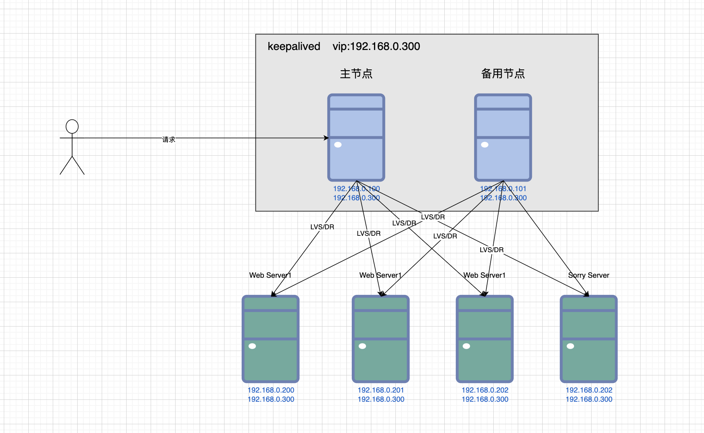

**时间:** 2024-11-08 18:05:05

**参考：**

1. [大型网站架构系列：负载均衡详解（1）](https://www.cnblogs.com/itfly8/p/5043435.html)
2. [大型网站架构系列：负载均衡详解（3)](https://www.cnblogs.com/itfly8/p/5080743.html)
3. [大型网站架构系列：负载均衡详解（4）](https://www.cnblogs.com/itfly8/p/5080988.html)

## 负载均衡

第七层：应用层（HTTP）

第六层：表示层

第五层：会话层

第四层：传输层（TCP、UDP）

第三层：网络层（IP）

第二层：数据链路层（Mac地址）

第一层：物理层（物理线路、数据传输）

负载均衡分为七层负载均衡和四层负载均衡。七层负载均衡作用在应用层，四层负载均衡作用在传输层。

### DNS 负载均衡
给同一个域名添加多条A类型的解析记录、分别解析到不同的IP地址。用户访问网站进行域名解析的时候，会根据用户的地理位置返回离用户近的IP地址。

**百度DNS配置如下（部分数据）：**

|域名|记录类型|IP|
|::|::|::|
|www.baidu.com|A|183.2.172.185|
|www.baidu.com|A|183.2.172.185|
|www.baidu.com|A|103.235.46.96|

### 二层负载均衡
通过修改数据包的Mac地址把数据转发到不同的服务器。

配置实际服务器的虚拟IP地址和负载均衡服务器的IP地址一致。数据分发时，修改目标的Mac地址，然后数据就会发送到对应的实际服务上进行处理。因为IP地址和负载均衡服务器一样，实际服务器处理完成之后可以直接把响应数据返回给用户。

#### LVS/DR

负载均衡服务器IP地址和实际服务器的虚拟IP地址相同，实际服务器处理完成之后把数据直接返回给用户。

### 三层负载均衡
即IP负载均衡。

**方式一：**修改源IP。

负载均衡服务器修改数据包的目标IP地址为实际服务器地址，同时修改源IP地址为自己的IP地址。当实际服务器处理完成之后会把响应返回给负载均衡服务器，负载均衡服务器把源IP地址改为自己的IP地址，目标IP地址改为用户的IP地址，然后把数据返回给用户。

#### LVS/NAT

使用方式一。

**方式二：** 将负载均衡服务器作为实际服务器的网关。

负载均衡服务器修改数据包的目标IP地址为实际服务器地址。当实际服务器处理完成之后会把响应返回给负载均衡服务器（网关），负载均衡服务器把源IP地址改为自己的IP地址，目标IP地址改为用户的IP地址，然后把数据返回给用户。

### 四层负载均衡
通过修改目标IP和端口把数据转发到不同的服务器。

### 七层负载均衡
Nginx。

