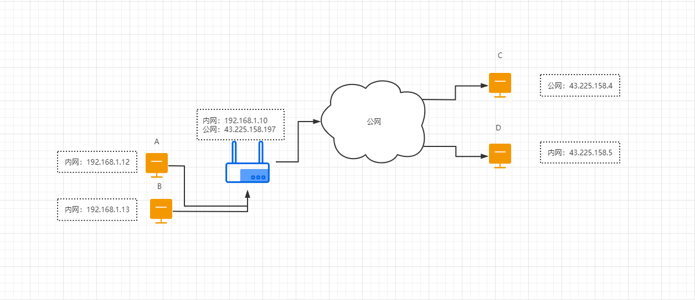

时间：2021-07-27 10:25:25

参考：

1. [rfc3235](https://datatracker.ietf.org/doc/html/rfc3235)
2. 《计算机网络》-谢希仁 `4.7.2 网络地址转换NAT`

##  NAT协议

NAT 协议，即 Network Address Translation。现在更多用于表示 NAPT，即Network Address And Port Translation。

NAT协议运行在支持NAT协议的路由器上，用于让局域网内没有公网地址的主机可以和公网上的主机进行通信。通信的发起方必须是局域网中的内网服务器。

### 怎么实现

局域网中的主机连接在路由器上，每个主机都有一个内网地址。NAT路由器记录 `内网主机IP+内网端口` 到 `路由器公网IP+路由器端口`的映射。当主机向公网发起网络请求的时候，路由器生成一条映射记录，当收到公网服务器的响应时，再通过映射记录查找出对应的内网主机，把数据转发到对应的内网主机。

绑定表如下：

假设：A通过8080端口请求公网主机C提供的服务。B通过8080端口请求公网主机C提供的服务。

|内网主机|路由器公网|
|::|::|
|192.168.1.12:8080|43.225.158.197:30001|
|192.168.1.13:8080|43.225.158.197:30002|

发送数据时，路由器修改数据的端口为路由器端口，修改数据的源地址为路由器的公网IP。
接收数据时，根据绑定表找到内网主机的IP和端口，转发到内网主机。
