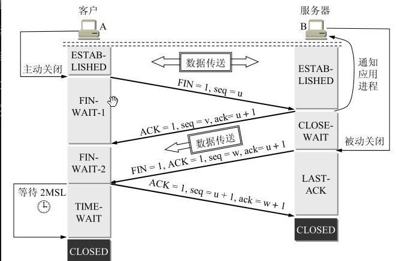

时间：2021-07-29 10:08:08

参考：

1 .  《计算机网络》谢希仁
2. [UDP-RFC768](https://datatracker.ietf.org/doc/html/rfc768)
3. [TCP-RFC793](https://datatracker.ietf.org/doc/html/rfc793)


## 计算机网络 运输层

运输层在网络层之上，在应用层之下。运输层有复用和分用的功能，复用体现在把不同应用程序的数据传递给网络层。分用体现在把从网络层接收的数据分发给对应的应用程序。

运输层属于计算机体系，即属于操作系统。应用程序发送数据时需要通过系统调用和传输层交互。

### TCP 协议

TCP (Transmission Control Protocol)传输层协议，面向连接，保证顺序，提供可靠的数据传输，全双工模式。传输的数据面向字节流，传输层不关心每次传输数据的开始和结束位置，需要应用层进行处理。

TCP 传出的数据称为TCP报文段，即 `segment`。

TCP的首部有20个字节。

#### TCP 数据传输

首先通过三次握手建立连接，第三次握手是为了避免在网络中延迟的建立连接的请求。

发送端有发送缓存，接收端有接收缓存。发送端缓存按序缓存需要发送的数据，接收端缓存按序缓存收到的数据。发送端从缓存中取出数据发送，接收端只能从缓存中读取连续的数据，这保证了数据按序到达。

确认消息，确认消息会随着发送的数据一起发送，如果没有发送数据则会单独发送确认消息，延迟不超过0.5秒。

超时重传：当有数据丢失时，接收端会在超时没有收到接收端的确认请求后重发数据。当接收端收到不连续的数据时，接收端也可以连续发送多次同一个序号的确认信息，发送端收到多次确认后会重传确认序号之后的数据。

流量控制，接收端每次发送确认消息之后都会告诉接收端自己剩余可用窗口的大小，接收端根据可用窗口大小控制发送数据的大小。为了避免控制消息丢失，当接收端收到的剩余窗口大小为0后长时间没有收到窗口大小变更消息，会发送控制消息给接收端请求窗口大小。

拥塞控制：根据网络拥堵状况动态调整数据发送速率，以避免网络拥塞。

慢开始和拥塞避免。慢开始是指开时发送数据时先发送一个报文段，之后每收到一次确认都增加一个报文段，这样每次发送的报文段成倍增长。拥塞避免是指当发送报文段增加到一定数量时每次只增加一个报文段，减慢报文段增加的速率。

快重传和快恢复。接收方每次收到不连续的报文后都对之前连续的报文进行确认，当接收方连续收到三个相同的确认报文后就对后面的数据进行重传。快恢复当接收端连续收到三个相同的确认报文后就把把同时发送报文段的数量减半，然后从减半后的数量开始每次增加1。

最终通过四次挥手关闭建立的连接，连接关闭后会保留一段时间。

#### TCP 三次握手

```
Client                                                      Server

发送建立连接请求 SYN = 1 SEQ=x ACK=0 ----------->              收到连接建立请求      第一次握手   

收到服务端响应  <----------SYN = 1 SEQ=y ACK=1 ack=x+1         响应连接建立请求      第二次握手
              
确认建立连接    SYN = 1 SEQ=x+1 ACK=1 ack=y+1 ---->           确认建立连接          第三次握手    
```

三次握手是为了避免网络延时导致客户端发送的一个连接建立请求很晚之后才到达服务器，服务器根据请求建立连接，浪费服务器资源的问题。此时建立的连接已经不需要了。

#### TCP 四次挥手



#### TCP 性能问题

TCP 连接数据发送要经以下几个过程。

1. 建立连接（三次握手）。 耗时 t1
2. 客户端发送数据。            耗时 t2
3. 服务端处理数据。            耗时 t3
4. 服务端响应数据。            耗时 t4
5. 关闭连接。                        耗时 t5。

其中 t5 可以忽略。

设: T = t1+t2+t3+t4+t5 = t1+t2+t3+t4

##### TCP 连接建立

TCP 连接建立需要耗费一定时间，如果连接建立之后发送的数据量比较小，会出现连接建立耗时较整个传输过程时间比重较大的问题。

即 `t1/T` 比值较大，可以通过复用TCP连接，减少 `t1` 所占比重。

##### 延迟确认

TCP服务器接收TCP数据后会向TCP客户端发送确认数据，确认数据会附加在其它数据块上发送，如果在一段时间(延迟)没有其它数据块要发送，则会单独发送确认数据。如果没有数据发送，就会等待一段时间。延迟时间通常是 100～200毫秒。

##### TCP 慢启动

TCP连接建立之后发送的报文段的数量是成倍递增的如 (1 => 2=>4=>8 ... )。第一次发送1个报文段，当这块数据确认收到之后再发送2个报文段，当2报文段都确认收到之后再发送4个报文段，以此类推。

##### Nagle算法

Nagle算法尽量发送全尺寸的分组（约1600字节），非全尺寸的数据会在收到其它全尺寸数据响应之后发送，由于延迟确认的存在，响应可能延迟100~200毫秒，如果缓存中的数据达到全尺寸大小也会进行发送。

> 全尺寸分组的数据：IP层发送的最大数据-TCP的20字节首部

##### TCP端口耗尽

TCP连接关闭之后，操作系统会在内存中缓存之前的IP地址和端口信息，缓存时间2分钟左右，缓存中的端口不能再次使用。

`客户端IP，客户端端口，服务器IP，服务器端口`

当在客户端建立到固定服务器的连接时，客户端IP，服务器IP，服务器端口都不变，可以改变的只有客户端端口，操作系统最大端口个数 (2^16 = 0 ~ 65535)，在两分钟内只能建立65536个端口。


### UDP 协议

UDP 传输层协议，无连接，不保证顺序，不是可靠的数据传输，全双工模式。UDP不提供拥塞控制。

UDP 传输的数据被称为UDP数据报。

UDP 不会对应用层的数据进行分割，而是添加首部之后直接交给网络层，网络层会根据需要对数据进行分割。因此接收方收到的完整数据报就是实际发送的数据。

UDP 的首部只有八个字节。源端口、目标端口、长度、校验和。

### QUIC 协议

Quic 协议是基于UDP的协议，增加TLS支持保证数据安全，提供拥塞控制减缓网络拥塞程度，提供可靠的连接。


