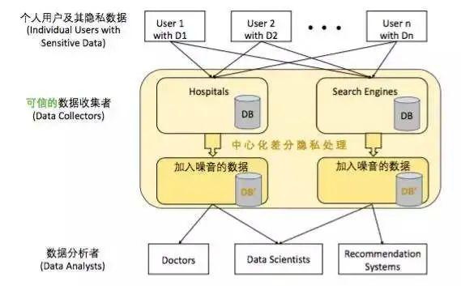

时间：2022-07-06 21:37:37

参考:

1. [分布式课堂：PlatON 创新研究院夏伏彪解析隐私计算技术](https://m.freebuf.com/articles/blockchain-articles/291394.html)

## 隐私计算 简介

现在业界提出隐私计算的时间并不太久，学术界对它的明确定义其实是源于 2016 年李凤华博士等人的一篇文章。但是当时的定义过于形式化，实际难以实现。目前隐私计算还是由以数据为核心的大数据行业来驱动的（包括金融、医疗、政务、物流、互联网等行业在这个数据的隐私保护上有比较强的需求）。

其次，隐私计算也有合规的需求：目前欧盟的 GDPR 以及美国医疗方面的法规已经比较完备了。国内大数据行业也不能像原先那样直接卖数据。比如说，两个企业之间需要数据共享，不能像原先那么简单粗暴以交易的形式来做，它会造成个人数据的隐私泄漏以及导致企业面临处罚风险。比如，企业 a 和企业 b 之间做这个数据共享，企业 a 直接把数据明文丢给企业 b；如果 b 拿到 a 数据再去卖，那么 a 的数据价值确实丢失了，同时伴有隐私泄露的风险。所以从这个层面来说， 数据明文共享或者数据明文交易，以后会越来越少。

如何用隐私计算的技术解决现有的数据共享或者数据协同的痛点？行业里面有一句俗语叫「 数据可用不可见」。比如说，a 和 b 之间要去做一个联合模型训练，b 有自己的模型，然后需要用到 a 的一些数据来把这个模型建的更加精确。数据原来是以明文的状态直接流动的，现在我们需要将它处理成密态数据，即以密码学的处理方式，使得整个建模过程中各方受到了隐私保护，b 无法逆推推出 a 的任意原始数据片段，a 无法获得 b 的模型信息。 「可用」指的是 b 最后把 a 提供的这份数据的价值用到了；「不可见」的意思就是说明文在它的全生命周期中，除了在 a 的本地以外，其他地方都无法解析获得。

隐私计算从技术的分类来看，有以下几个主要方向：首先是以密码学为核心的隐私计算技术栈，包括安全多方计算、零知识证明以及同态加密等，其次是联邦学习、可信执行环境以及差分隐私等技术。

### 差分隐私

差分隐私是一种偏统计学的概念，最早在医疗行业有需求。它的意思是 我对一个数据库加入一些噪声进行扰动，加完噪声之后的数据库和原始数据库相比，查询的准确性仍然很高，同时新数据库被识别出隐私的概率被最大限度地降低。

差分隐私这个技术的使用场景相对比较有限。比如说当医院获取到一些病人的基因数据，但不希望任何人通过这些病人基因数据关联一些外部的数据库（比如病人在某个医院的医疗信息），识别到病人的身份。当类似于数据库之间需要做这种联立攻击的情况下，可以用差分隐私来保护。但这种技术不属于主流的隐私计算，因为它没有办法去做一些像联合建模或者数据交集计算这些常用的任务。

### TEE

通俗地说，TEE 是将所有的任务都丢到一个黑盒子里面去计算。通常我们会将计算的时候用到代码和数据放在操作系统层面。黑盒子是在操作系统里面的一个特殊的可信执行环境。那这种可信执行环境使得你可以将涉及敏感数据的计算任务都丢到这个盒子里面。在可信执行环境里面跑的可信应用是无法和普通的应用做数据交互的。当它跟外部的数据作交互的时候，需要通过特殊的一些安全接口，同时它的运行时安全也做得比较好。

目前，这个技术比较大的问题是它的安全性完全建立在对 TEE 产品的信任上。国际上 Global Platform 国际标准化组织最早做这块的标准。目前实现技术主要有英特尔的 SGX、AMD 的 SEV 和还有 ARM 的 Trust Zone 等。

隐私计算里面需要用到的任务，TEE 差不多都能跑起来，但是它会有一些局限性。因为它是一个硬件部署，所以硬件的升级改造通常没有软件那么轻量级和方便。如果硬件出了一个漏洞的话，出现的问题会比较大；以及 TEE 有时候无法处理一些对网络带宽和计算资源要去比较高的任务。TEE 的好处就是它的设计和架构部署相对比较简单。

### 联邦学习

联邦学习（Federated Learning, FL）最早是由谷歌提出来的，他们当时要解决的一个问题：谷歌希望将每个人分布式手机上的数据汇总到一起，然后做一个模型的训练。所以谷歌一开始提出的联邦学习的开源框架是基于移动的环境下的。发展到现在，像微众银行、百度，包括谷歌自己，都提出了各自的联邦学习的技术框架。联邦学习其实主要解决的就是怎么样在一个分布式的环境下，各个参与方有各自的数据，如何将这些数据充分运用起来进行模型训练，又能满足各个参与方的隐私诉求（参与方不希望把自己的数据告诉剩余方，甚至是可信平台）。

联邦学习的算法需要用到一些机器学习的模型建模的：比如说神经网络、逻辑回归或是线性回归。 联邦学习中，多个数据源在分布式的条件下，希望仅通过传递梯度来保护数据隐私和完成模型训练。并且假设中间层的梯度值泄露出来不影响安全性，不会导致攻击者对原始数据的获取。

联邦学习它有很多优点，比如支持比较多的 AI 算法，且效率比较高。联邦学习的缺点在于这套技术是 AI 专家提出来的，它的安全性基础缺乏理论支撑。目前业界也会对一些联邦学习的方案做攻击，并且基于梯度安全性的攻击，已经有一些成果出来了。

从具体的联邦学习分类来看，因为每一方的数据分布不同，其架构设计也是有差异的。通常分为横向联邦和纵向联邦，分别面向相同维度但是不同用户组，和不同维度但是相同用户组的建模场景。

### 同态加密

同态加密是一种特殊的加密技术。加密是如何将明文进行变换，变成密文的一个过程。同态加密是什么意思呢？它的本质就是说我可以对密文做计算。密文本身它是一个无序、内容随机分布的一串「code」，因此对密文计算是比较难的事情，但是同态加密就可以实现。 同态加密的意思是，对两个密文进行操作的结果，等于对这两个密文对应的明文 m1、m2 进行操作后再加密的结果。举个例子。假设 Alice 希望工匠帮她把两个金块加工成手镯。在这个加工过程中，她希望工匠无法把这个金块的碎片收集起来。因此工匠需要借助一个特殊的装置。这个装置是透明的并且带了一把锁（仅有 Alice 可以打开这把锁拿到装置内部的物体），并且固定了一个手套，工匠可以将双手放到手套里，隔着装置进行精细的加工，但是戴着手套，并且手套无法离开装置，工匠实际上无法触碰到任何的金块和金块碎片。在这个例子里，装置里的两个金块可以看成原始密文 Encrypt(m1) 和 Encrypt(m2)，工匠所做的事情，就好像是他在盒子的遮挡下在操作密文，而 Encrypt(m1+m2) 就是装置里的手镯，Alice 通过解锁获得了手镯，即 m1+m2。

同态加密需要解决的一个核心问题是可以支持任意类型的计算。任意的意思是指加法和乘法，因为所有的计算程序抽象为算术电路表示都可以用加法和乘法实现。传统的联邦学习用的一般是加法同态加密系统，而著名的商用密码算法 RSA 就是一个乘法同态加密算法。最厉害的是全同态加密，指的是对于既支持加法操作又支持乘法操作，并且计算次数没有限制的加密算法。这种方案特别非常少，直到 2009 年第一个全同态加密方案被 Gentry 等人提出来。现代的全同态加密系统，一般基于格理论等基础工具，可以对抗量子攻击。

### 安全多方计算

安全多方计算（MPC）是由图灵奖获得者，中国科学院院士姚期智先生最早提出来的。姚先生当时提出了一个百万富翁问题，两个富翁非常有钱，他们互相之间要比较谁更富有，但是又不想告诉对方自己具体的财富数，同时他们不希望依托一个可信的第三方来完成问题的回答。事实上，MPC 要解决的就是多个参与方在不泄露隐私数据的前提下，如何协作，完成对一个问题的求解。当然，各方要计算的任务是公开的。比如说多方之间想要做一个联合的加法或者联合的建模，模型是逻辑回归，需要多少轮等这些细节是约定好的。MPC 的结果输出一般是可以指定的，可以以明文形式输出，也可以以密文形式输出并且分割在多方进行保存。

MPC 有两个模式，一个模式就是用户有一个隐私输入 x ；然后服务提供商有一个隐私输入 y，根据一个公开的计算函数 f, 两方协作最后会输出一个 f(x,y)。还有一种模式是，用户输入 x，然后服务提供商提供计算函数 f，服务提供商希望把函数 f 藏起来，最后两方协作输出 f(x,y)。这两种模式在业务上是有差别的，一种是算法是公开的，另一种是算法是隐藏的，但是对于 MPC 底层电路而言，其本质是一样的，算法设计部分其实没有太大差别。

传统的 MPC 技术路线分为两类，分别针对两类不同的电路系统。 一类叫 布尔电路，指的是每一个计算单元的表示形式是布尔门（与门、或门、非门）；这类布尔电路，会有一套专门的 MPC 密码协议来处理。另一类叫 算术电路，指电路完全由加法和乘法组成。出于性能效率的原因，不同的电路类型任务需要用选用不同的密码协议来实现。

安全两方计算所使用的协议一般为混淆电路（GC）结合不经意传输（OT）；而安全多方计算（指三方或者三方以上）所使用的协议一般为秘密分享（SS）结合不经意传输。前者（GC+OT）主要的问题在于计算开销会比较大，而且一般比较适合于做两方之间的隐私计算。它的好处在于需要的通讯轮数比较少。后者的问题在于通常需要迭加多轮 OT，会引入非常高的通讯轮数；它的好处在于计算开销比较小。对于网络要求比较高的这种场景里面不太适合用这种 SS+OT 的方法。

从目前的工程经验来看，业界用 SS+OT 实现基于算术电路的 MPC 方案较多。当然本质上技术的选取还是跟计算任务相关。很多情况下，比如说你要做 AI 建模涉及较多的乘法、线性运算，更适合用算术电路来实现；而如果要做一些比较查询，更适合用混淆电路来处理。

在实际的 MPC 部署问题上，我们通常会把数据方和计算方分开。这样可以尽可能地支持更多的参与方，并且实际的计算节点不会太多，一般会有两个或者三个。否则增多计算节点，会导致通讯轮数指数级的上升，网络开销无法承担。

### 零知识证明

零知识证明（ZKP）是反直觉的，简单来说是证明者向验证者进行证明「我知道问题的解」，但不直接透露解，验证者完成验证后会确信前者知道解但是无法获得任何解的信息。通常 ZKP 的两方之间需要进行交互通信，属于一种「交互式证明系统」。实际的设计里，出于通讯效率的考虑，可以将各类 ZKP 系统转成非交互式。零知识证明目前主要还是用来做认证相关的场景。

传统的零知识证明系统里，一般是形如证明者提供承诺-验证者发出随机挑战-证明者完成应答的交互式「三步曲」。通常证明者可以用类似随机猜测的办法以一定概率完成验证者的挑战，需要把这个三步曲过程重复很多轮，来尽可能降低证明者欺诈的概率。目前 ZKP 的非常热门，涌现了如 zk-SNARKs, zk-STARKs, bulletproof 等非常优秀的通用类 ZKP 系统，可以实现对任意论述的证明。

零知识证明在区块链中用的最多的就是做隐私交易，主要是指隐藏交易三要素——付款人，收款人以及金额。目前像 ZCash、Monero等隐私代币都有很不错的隐私交易技术。在联盟链里，需要考虑审计等第三方介入的场景，因此需要将零知识证明与审计需求进行技术上的结合。

从技术路线来看，目前零知识证明的算法有个主要的问题是，——一去创建零知识证明系统的时候，整个系统它会有一些初始化的参数，这些参数的创建过程其实是需要一定的信任假设的。比如可以找一个可信的第三方来创建，创建过程中会用到一些随机数，那这些随机数如果持续不删除的话，获得了这些随机数的人就可以成功地伪造证明。这也就是所谓 trust setup 问题。各类通用 ZKP 系统目前均无法很好地解决这个问题，有些是需要通过一个额外机制来实现这个可信的初始化过程，有些是无需可信初始化但是会造成很严重的效率问题。

### 代理重加密

代理重加密解决的是一个数据外包共享的问题。一个典型的例子是， a 想要把她的数据保存到云端，同时不想让云看到这个数据，所以她的数据显然是需要加密再放到云端的。某个时刻，b 需要向 a 获得这个数据，a 又不想自己直接把这个数据下载下来解密后再传给 b，那么有没有什么办法完成业务需求？代理重加密就是解决这个问题的。首先，云端有这个 a 的加密数据，云会借助代理重加密技术把 a 的密文转成 b （能够解开）的密文。所以这里面有一个显式的密文转换操作。b 经过 a 的授权，从云端下载了转换后的密文，再用自己的密钥解开，就可以获得 a 的数据明文。a 是一个轻计算节点，所有的重型计算都是在云端操作，然后这里面借助一个授权过程，云端把这个密文进行计算转换（并不是简单地将 a 的密文解密后用 b 的公钥加密，而是一种特殊的密文计算）。

从计算类型来看，隐私计算其实是关联实际的业务场景的。前面提到的是机器学习相关的计算是一大类；还有一类叫集合运算，其中典型的问题就是两方之间做集合的交集：a 有一个集合 x，b 有一个集合 y；a 作为发起方，b 作为协作方，然后计算完成后，发起方 a 能够得到中间的这部分交集 x∩y，但是她无法知道 y 中的剩余元素；另一方面，b 全程无感，即 b 不知道 x∩y。这个就是所谓的隐私集合求交问题（PSI）。PSI 涉及的具体场景很多，例如两个数据库撞库，黑名单查询等。