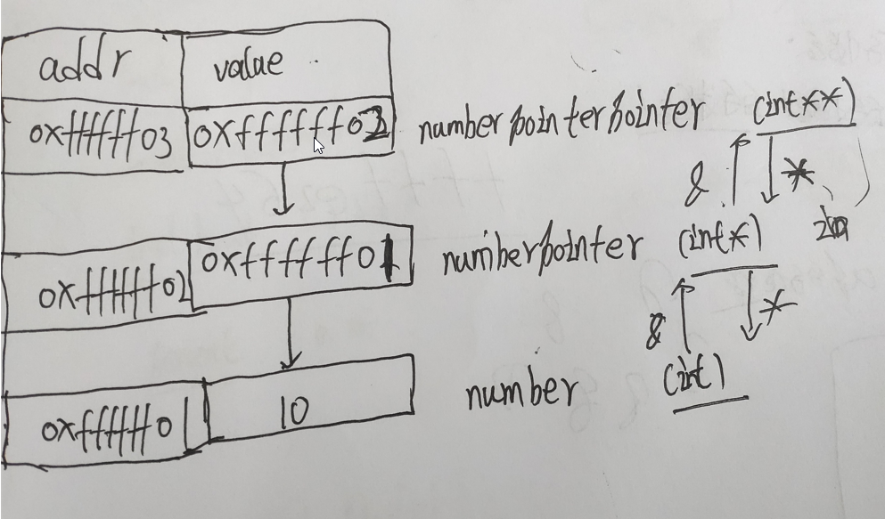

时间：2021-09-13 10:33:33

参考：

1. []

## C 指针

### C语言指针究竟是什么？

指针代表一个内存地址。

指针指向内存地址，在内存中一个字节有一个地址。8比特位表示一个字节。指针的大小和操作系统有关，32位操作系统CPU的最大寻址空间是4字节，指针的长度为4字节，在64位系统，CPU的寻址空间是8字节，指针的长度是8字节。

指针是为了方便操作内存，不同类型的数据占用的内存空间不以言给。比如int占用4字节，short占用2字节，char占用1字节。指针指向int类型时，`+1` 操作会使地址增加4；指针指向char类型，子`+1` 操作会使地址增加 1。

### 指向指针的指针有什么含义？

指向变量的指针存储变量的地址，指向指针的指针存储所指向的指针的地址。

```c
int number = 10;
int *numberPointer = &number;
int **numberPointerPointer = &numberPointer;

printf("number:%d\n", number);
printf("numberPointer:%p\n", numberPointer);
printf("numberPointerPointer:%p\n", numberPointerPointer);
```

上面的代码：

`number`: 在程序里面表示一个变量，变量的值是10，对变量赋值可以改变内存中存储的值。当变量当作参数传递的时候传递的是变量的值，在方法中修改变量对应的值不会改变原始地址的值，因此如果想要改原始地址的值，需要传递指针，即变量的地址。

`numberPointer`: 在程序中表示一个 `int指针`，指针指向的地址存储 `int类型数据`。因此 `numberPointer` 就是 `number`变量在内存中的地址。

`numberPointerPointer` 在程序中表示一个 `int指针的指针`，指针指向的地址存储 `int*类型数据`，对于32位系统指针大小是4字节，对于64位系统指针大小是8字节。因此 `numberPointerPointer` 存储的就是 `number 变量的指针的地址`。

关系图如下：



```c
(gdb) x /10xg &numberPointerPointer
0x7fffffffe268: 0x00007fffffffe258      0x0000000000000000
0x7fffffffe278: 0x00007ffff7a2f555      0x0000000000000000
0x7fffffffe288: 0x00007fffffffe358      0x0000000100000000
0x7fffffffe298: 0x0000000000400530      0x0000000000000000
0x7fffffffe2a8: 0x156cad9a98527950      0x0000000000400440
(gdb) x /10xg &numberPointer
0x7fffffffe258: 0x00007fffffffe264      0x00000014ffffe350
0x7fffffffe268: 0x00007fffffffe258      0x0000000000000000
0x7fffffffe278: 0x00007ffff7a2f555      0x0000000000000000
0x7fffffffe288: 0x00007fffffffe358      0x0000000100000000
0x7fffffffe298: 0x0000000000400530      0x0000000000000000
(gdb) x /10xg &number
0x7fffffffe264: 0xffffe25800000014      0x0000000000007fff
0x7fffffffe274: 0xf7a2f55500000000      0x0000000000007fff
0x7fffffffe284: 0xffffe35800000000      0x0000000000007fff
0x7fffffffe294: 0x0040053000000001      0x0000000000000000
0x7fffffffe2a4: 0x9852795000000000      0x00400440156cad9a
```
