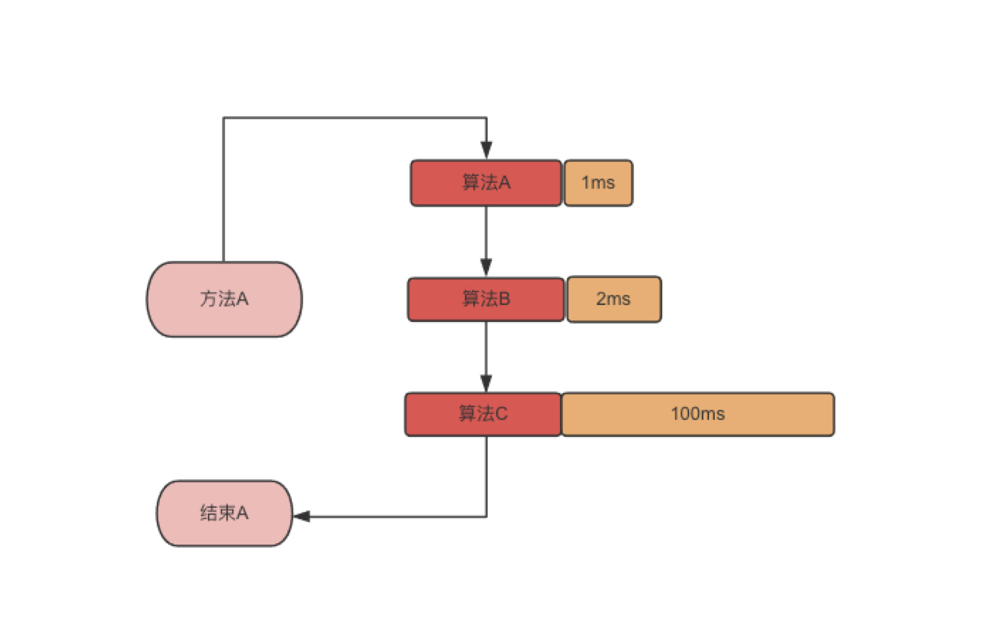
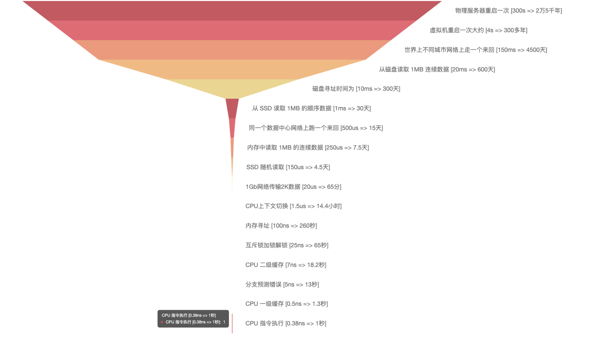
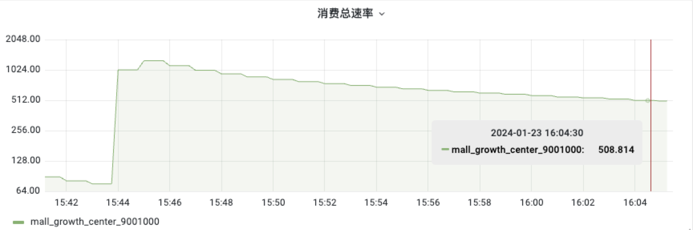
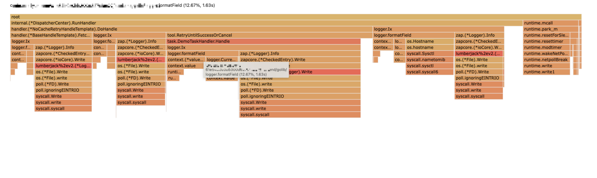
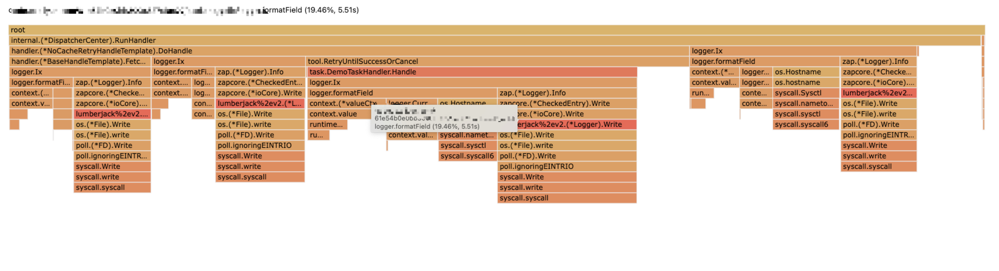
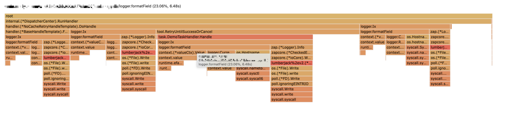
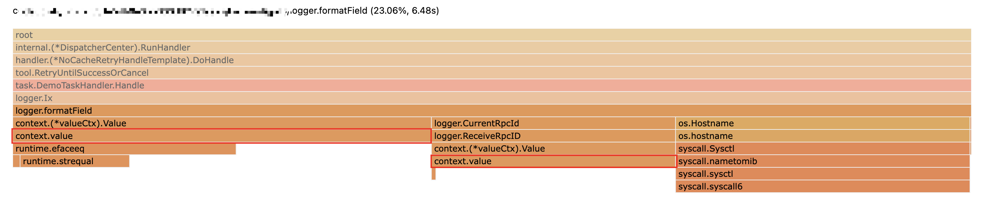
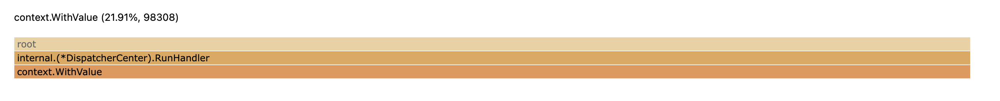

时间: 2023-12-18 15:03:03

参考：
1. [让 CPU 告诉你硬盘和网络到底有多慢](https://cizixs.com/2017/01/03/how-slow-is-disk-and-network/)
2. [郑建勋：代码优化的三重境界](https://mp.weixin.qq.com/s?__biz=MjM5NTk0NjMwOQ==&mid=2651158406&idx=1&sn=e5ae249e07694991a8f14c255dbd5153&chksm=bd011dac8a7694bada7fc9acf6b8be2bf577255c2eaef8653e6dfcf3ba8cc8b0161802fba41f&scene=27)
2. [郑建勋：Go程序性能分层优化 | CPU篇](https://mp.weixin.qq.com/s?__biz=MzAwNDUxOTQ5MQ==&mid=2247521593&idx=1&sn=bd532d38ef1d438b1ceb3825826aaa7e&chksm=9b287615ac5fff0366a04917d109d0f212a3c2c99badf2fbd584a9f2a6f1d3d4997f27bfa961&scene=21#wechat_redirect)
3. [Go 大杀器之性能剖析 PProf](https://eddycjy.gitbook.io/golang/di-9-ke-gong-ju/go-tool-pprof)
4. [Go 大杀器之跟踪剖析 trace](https://eddycjy.gitbook.io/golang/di-9-ke-gong-ju/go-tool-trace)

## Go 性能优化

### 简介

**简介：** 通过优化代码逻辑，提升系统性能。

常见的提升性能的手段：

* 提高机器配置。主要包含CPU、内存、带宽、磁盘等。
* 增加机器数量。
* 提高算法效率。优化算法是算法的时间耗时更低。
* 优化代码逻辑。使用性能更高的方法、类库。
* 并发。并发处理业务逻辑，让计算机资源得到充分利用。
* 连接复用。数据库连接池等。
* 使用缓存：缓存处理结果，避免重复计算。可用本地缓存 、分布式缓存等。
* 慢查询优化。
* 使用更切合场景的数据存储。如时序数据库、OLAP 数据库等。

**过程：** 找出系统性能瓶颈，使用不同优化手段解决性能瓶颈。

**原则：** 

* 优先优化对系统性能影响比较明显的问题。
* 避免过度优化。




### 耗时

计算机不同层次、不同操作耗时如下图所示：




###  什么时候优化？

* 开发完之后发现性能不能满足线上需求。
* 压测性能不达标。
* 线上接口响应缓慢？


### 性能分析工具

#### 基准测试


数组和map遍历性能。

#### pprof 工具使用

```go
package main

import (
	"fmt"
	"math/rand"
	"net/http"
	"time"
	
	_ "net/http/pprof"
)


func main() {

	go func() {
		err := http.ListenAndServe(":8080", nil)
		if err != nil {
			panic(err)
		}
	}()

	time.Sleep(time.Hour * 100)
}
```

常用命令：

```
# 查看 CPU 使用情况
go tool pprof -sample_index=cpu -http=:8084 http://127.0.0.1:8080/debug/pprof/profile\?seconds\=30
```


##### 一次线上问题排查过程

**业务：**从 Kafka 拉取数据，然后转换成需要的格式，保存到数据库。

**问题现象：** Kafka 消费者的消费速率随着消费时间变长越来越低，由初始的 `1100 c/s` 降低到 `508 c/s` 。

如下图：



**问题定位**


**第一步：查看线上日志**：线上日志记录了消费消息及消息处理每个过程的耗时，耗时统计如下：

项目刚启动时的耗时统计  `2024-01-23 15:45:20`

```go
msg: time cost, fetch: 0ms, handle: 8ms, commit: 0ms, total: 8ms
```

消费速率下降时的耗时统计 `2024-01-23 16:04:29`

```go
msg: time cost, fetch: 3ms, handle: 10ms, commit: 0ms, total: 14ms
```

* fetch： 从 Kafka 拉取数据耗时。
* handle：处理消息存入数据库耗时。

**可疑点一：**由于 `fetch` 时间变长，怀疑是从 `kafka` 拉消息的时间变长到值。

**处理：** 

**首先**：怀疑是 `Kafka-go` 包的版本过低，拉取消息存在性能问题，升级 `Kafka-go` 版本，升级之后问题依然存在。

**然后：** 怀疑 `Kafka-go` 客户端参数配置有问题，修改参数配置，问题依然存在。


**第二步：** 仔细观察发现 `handle` 时间也变长了，猜测是 `fetch` 和 `handle` 两个地方 `公用的代码` 导致耗时变长。

**处理：**

**首先：**查看代码发现只有打印日志的代码是公用的。后在本地验证，发现随着时间变长打印日志耗时增加。

拉取消息后打印日志：

```go
logger.Ix(ctx, t.Handler.GetName(), "fetch message success. topic", "")
```

处理消息后打印日志：

```go
logger.Ix(ctx, t.Handler.GetName(), "handle message success.", "")
```

**可疑点一：** 怀疑是日志框架参数配置问题，通过调整日志框架参数，发现问题依然存在。


**第三步**：观察CPU耗时，下面是项目启动之后的 CPU 耗时统计。

**刚启动**



**启动一段时间**



**更长时间**



**分析：** 分析发现随着启动时间变长 `logger.formatField` 方法占用的时间也变长，定位到问题在这个方法调用上。而且耗时增加主要消耗在 `context.value` 这个方法上。

方法代码如下：

```
func formatField(c context.Context, tag string) []zapcore.Field {

	fields := make([]zapcore.Field, 0)

	hostname, _ := os.Hostname()
	fields = append(fields, zap.String("host", "hostname"))

	// var traceID string
	trace := c.Value(ContextKey("x_trace_id"))
	// 省略 ...
	rdomain := c.Value(ContextKey("domain"))
	// 省略 ...

	return fields
}
```

`logger.formatField` 调用方法耗时。



**定位：** 正常情况下 `c.Value("")` 方法耗时应该是固定的，不会随着运行时间变长而变长，应该是错误使用 `contxet` 导致的。

异常代码：

```go
func (d *DispatcherCenter) Run() {
 
    //消费者数量加一
    d.waitGroup.Add(1)
    for {
       // 这里循环赋值，导致 context 的层级越来越深，从 context 里面获取 value 耗时变得越来越长。 
       ctx = context.WithValue(ctx, logger.ContextKey("x_trace_id"), uuid.NewV4().String())
     
       select {
       case <-ctx.Done():
          d.waitGroup.Done()
          return
       default:
					// do something ... 
       }
    }
}
```

**用内存分析定位：**

找问题的时候没有使用，用内存一目了然。

**在用对象**




#### Trace 分析