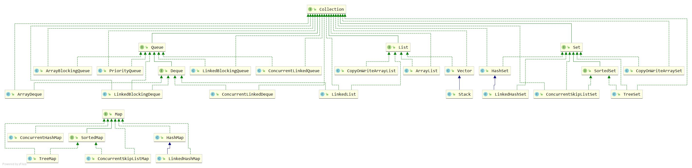

时间：2017-03-18 17:39:18 

## 集合类

### List 列表 

#### ArrayList（非线程安全）

**描述**： 用数组实现，添加元素时如果数组没有空余位置，会惊醒扩容。

**默认大小**：10

**扩容大小**：原始大小 + (原始大小 >> 1) 等于 原始大小 + 原始大小/2

**优缺点**:

 * 优点：根据位置（第几个）访问元素快。
 * 缺点：删除元素效率低。

#### LinkedList（非线程安全） 

**描述**： 用双链表的方式实现，容量大小不收限制。

**优缺点**：

 * 优点：删除元素效率高。
 * 缺点：根据位置（第几个）访问元素慢。 

#### Vector（线程安全） 

**描述**： 基本等同于ArrayList，但由于是线程安全的，单线程情况下，性能相对ArrayList差。

### Stack 栈(线程安全) 

**描述**: 继承 Vector。Vector是线程安全的容器类。 
**主要方法**： 

 * pop : 从栈顶取出一个元素。
 * peek: 获得栈顶元素，但是不取出元素。
 * push: 向栈顶放入一个元素。 

### Queue 队列

#### ArrayList和LinkedList（非线程安全） 

**描述**： LinkedList实现了Dueue(Dueue实现了Queue)接口，可以通过 `Queue<String> queue = new LinkedList<>()` 的方式初始化队列。 

**主要方法**： 

 * add : 插入队尾，没有空间可用抛出异常
 * offer ：插入队尾，插入失败返回false。
 * remove : 获取并删除队头，队列为空会抛出异常。
 * poll : 获取并删除队头，队列唯恐会返回空。
 * element : 获取但不从队头移除，队列为空抛出异常
 * peek : 获取但不从队头移除，队列为空返回null。

#### PriorityQueue(非线程安全)

**描述**： 根据选择构造方法不同，元素排序的方式不一样，默认是自然顺序（实现的Comparable）。初始化的时候也可以指定对应的比较函数。

#### PriorityBlockingQueue（线程安全）

**描述**： 类似于 `PriorityQueue` ，是线程安全的。

**主要方法**: 

 * `drainTo(Collection<? super E> c)` ： 移除此队列中所有可用的元素，并将它们添加到给定 collection 中。

### Set 集合

#### HashSet（非线程安全）

**描述**： 元素有序且不能重复。 内部使用HasMap实现。 

#### LinkedHashSet（非线程安全）

**描述**： 继承HashSet，元素按添加的顺序进行排序，不能有重复元素。

####  TreeSet（非线程安全) 

**描述**： 元素不能重复，且有序。基本操作（add、remove 和 contains）提供受保证的 log(n) 时间开销。

### Map 键值存储

#### HashMap（非线程安全）

**描述**： Key不能重复，允许使用 null 键和 null 值，根据key进行排序。

#### LinkedHashMap(非线程安全)

**描述**： 继承HashMap，根据元素添加的顺序进行排序。

#### HashTable（线程安全）

**描述**： Key不能重复，不允许使用 null 键和 null 值，根据key进行排序。