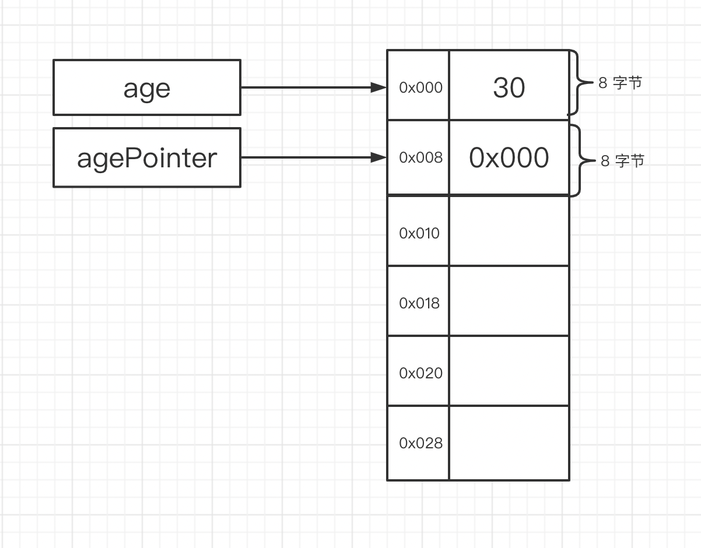

时间: 2022-12-01 18:00:00

1. [计算机如何知道存储的数据是什么类型？](https://www.zhihu.com/question/21634439)

##  编程语言 变量

### 定义变量

在64位机器上，寻址空间需要用8字节表示，因此指针大小为8字节。

写程序的时候会定义变量，变量记录对应数值的存储地址。

 ```go
 var age         uint64 = 30
 var agePointer *uint64 = &age
 ```

**如上：**

变量 `age`  ，类型是 `uint64` 值是 `30`，变量 `age` 指向一个存地址，该内存地址存的数据是  `30`，占用8字节空间。

变量 `agePointer`  ，类型是 `*uint64` 值是 `age变量的地址`，变量 `agePointer` 指向一个内存地址，该内存地址存储的数据是 `age的地址`，占用8字节空间。

`age ` 和 `agePoint` 都是变量，不过x他们的  类型不同，存储的数据也不同。

**内存空间如下图所示：**




### 疑问

#### 变量的类型信息存储在哪里？

编译器编译代码时会对代码进分析，生成对应的目标代码，不同类型的变量生成的代码也不一样。

程序运行时内存中没有存储变量的类型信息，计算机只是执行编译之后生成的指令。

