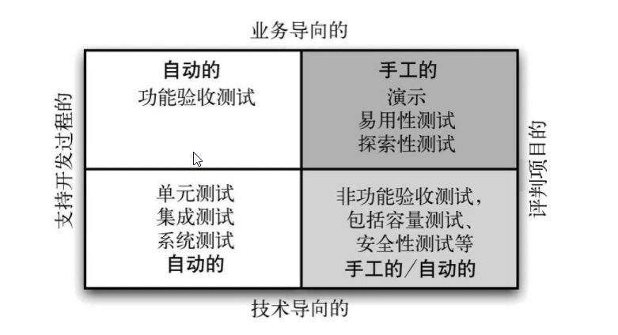

时间：2019-08-04 09:02

1. 《持续交付:发布可靠软件系统的方法》- Jez Humble  David Farley

##  软件测试专业名词 

> 图片来源：《持续交付:发布可靠软件系统的方法》第四章第二小节

### 单元测试

测试一个方法、一个函数，一小组方法、一小组函数之间的交互。不需要启动整个程序，不需要连接数据库，不需要访问文件系统等，不需要网络访问。

运行时间很短。

### 组件测试

测试应用程序几个组件的行为。通常不用启动整个程序，但可能需要连接数据库、访问数据库或通过网络调用其他系统。可以使用打桩或者Mock来代替数据库访问、文件系统访问和外部接口调用。

运行时间通常比较长。

### 集成测试

验证各个模块之间依赖关系是否正常。

### 部署测试

部署测试用于检查部署过程是否正常。指应用程序是否被正确地安装、配置，是否能与所需的服务正确通信，并得到相应的回应。

### 功能测试（验收测试）

测试系统特性的方方面面，包括其功能（functionality）、容量（capacity）、易用性（usability）、安全性（security）、可变性（modifiability）和可用性（availability）等。

运行时间很长。

### 非功能测试 (验收测试)

#### 性能测试

测试项目的性能，吞吐量。

#### 安全性测试

### 回归测试 

代码修改之后，重新进行测试以确认修改没有引入新的Bug或导致其他代码产生错误。

###  冒烟测试 

用于确认代码会按预期运行，且不会破坏整个版本的稳定性。

### 非回归测试 

